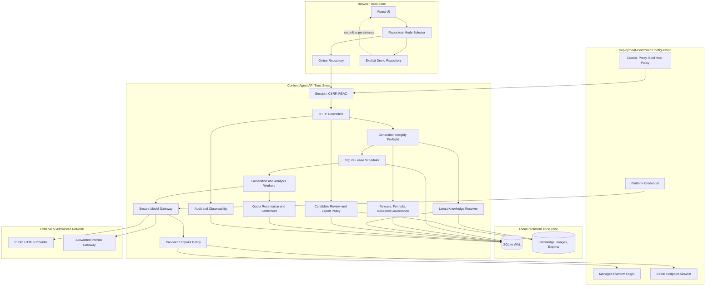
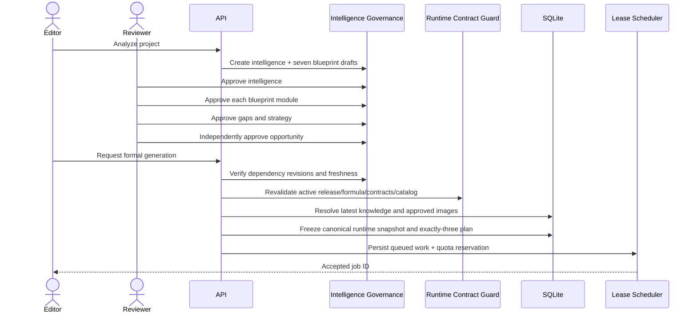
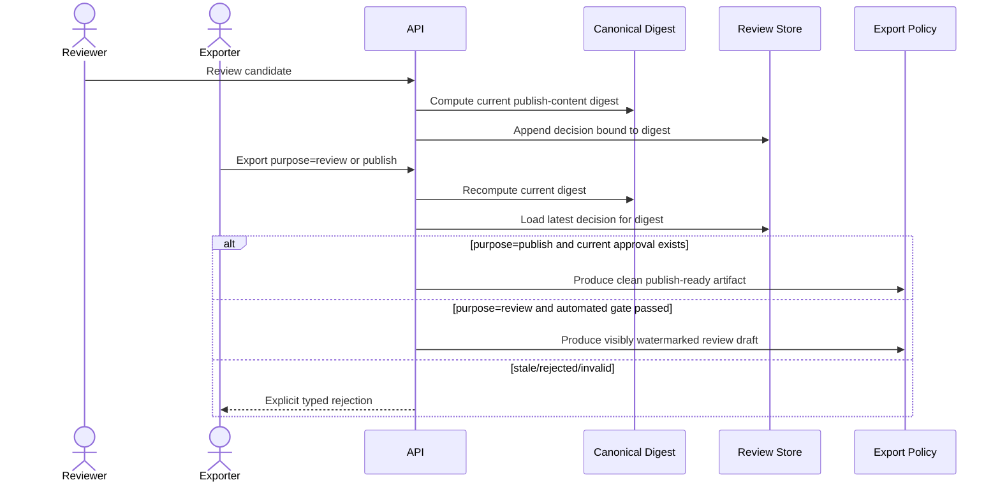
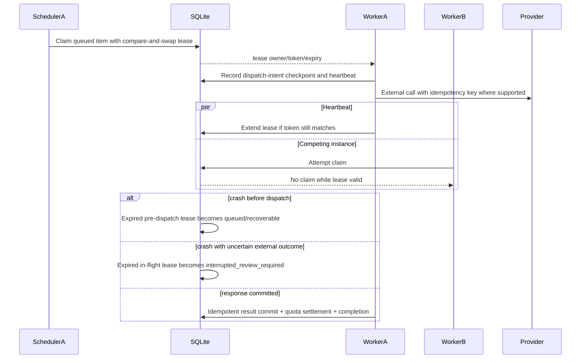
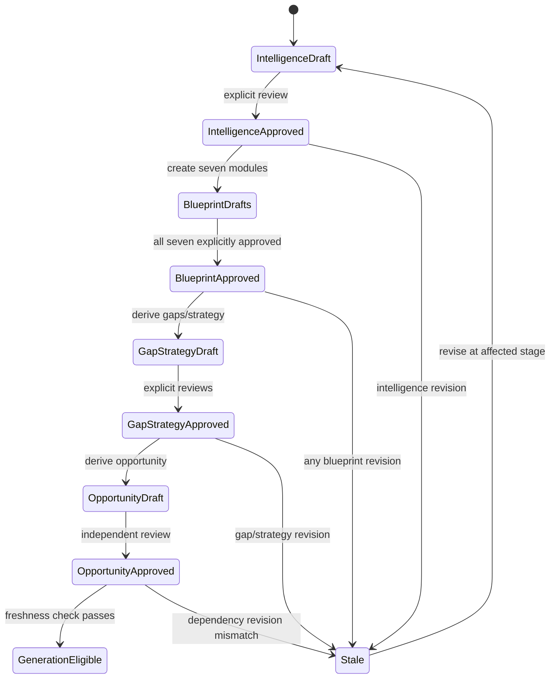
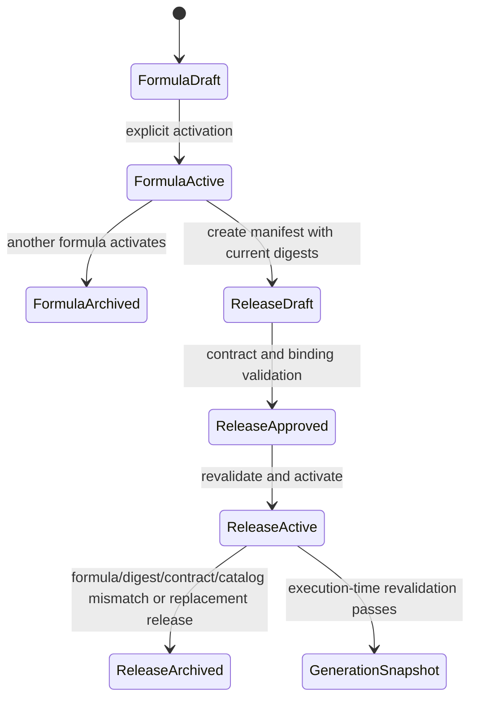
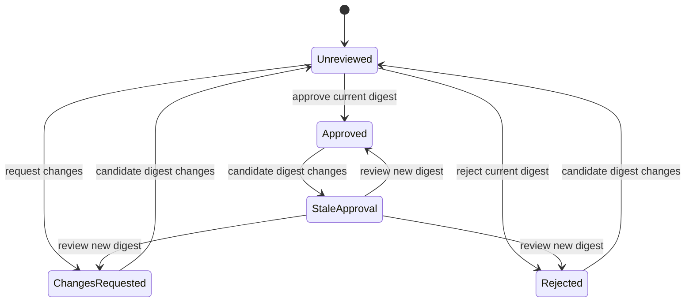
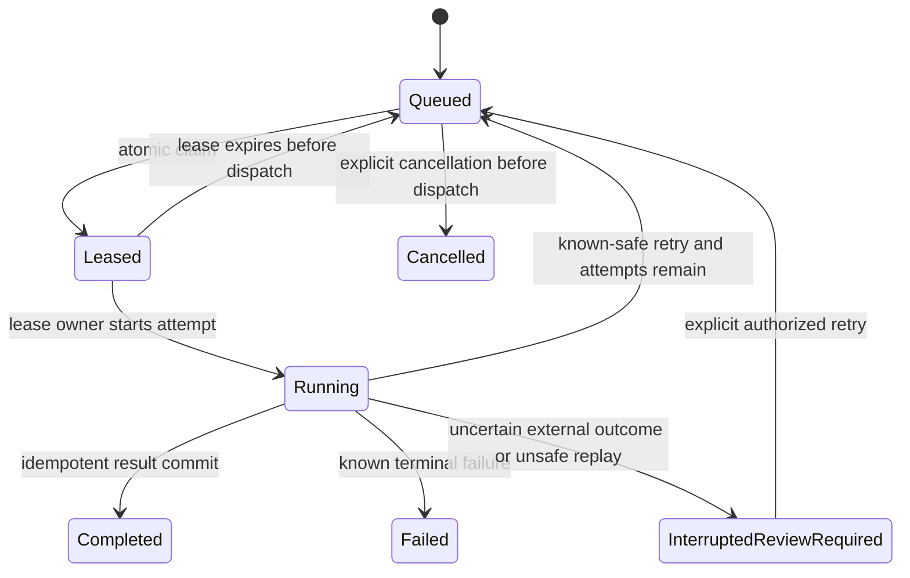

# Design Document: Content Agent Integrity Governance Hardening

## Document Status

- **Feature**: `content-agent-integrity-governance-hardening`
- **Workflow**: Design-first
- **Design detail**: Comprehensive diagrams and interfaces
- **Repository boundary**: Only files under `.kiro/specs/content-agent-integrity-governance-hardening/` may be created or changed by this workflow.
- **Current implementation baseline**: Batch A has already been implemented and targeted-validated before this design-first spec was requested. Batch B has only been inspected and refined; B–E have not been implemented.
- **Approval state**: **Approved by the user for requirements derivation.** All six implementation-policy defaults formerly listed as open questions are approved and closed; no design question remains open.

## Overview

This design hardens integrity, governance, security, persistence, and export controls across the Content Agent lifecycle. It preserves the existing intelligence → seven-module blueprint → gap/strategy → opportunity → generation flow while making every transition explicit, freshness-checked, auditable, and fail-closed. Formal generation becomes a reproducible run bound to one active release, one active formula and its digest, current runtime-contract digests, latest knowledge versions, an independently approved and fresh opportunity, approved image observations, resolved parameters, and exactly three candidates.

The design separates facts supplied by a project from externally verified facts. `user_supplied` and `source` identify provenance, not independent verification. Dynamic medical, price, campaign, credential, guarantee, and similar claims remain subject to candidate-level human publication review even when automated validation passes. Research remains outside prompt construction unless an approved calibration is bound to an approved and active release.

The hardening is delivered in ordered batches A → B → C → D → E, followed by full validation. Batch A is treated as an implemented baseline that must be rechecked in the final validation stage, not reimplemented or reverted. The remaining batches introduce endpoint/credential coupling and SSRF controls, explicit repository modes, digest-bound candidate review, and SQLite-backed leased work execution with idempotent quota accounting.

## Goals

1. Make knowledge, formula, release, catalog, prompt, parameter, opportunity, and image inputs deterministic and freshness-checked at formal generation time.
2. Prevent workspace-controlled endpoints from receiving deployment-level platform credentials.
3. Permit BYOK access to explicitly allowlisted internal gateways while defaulting to public HTTPS endpoints.
4. Make online reads and writes fail closed, with demo state available only through an explicitly enabled and visibly isolated repository.
5. Distinguish automated validation from human publication approval and bind candidate approval to a canonical content digest.
6. Permit clearly marked review-draft exports before approval while reserving clean/publish-ready exports for approved, unchanged candidates.
7. Replace process-local queues with SQLite-backed leases, heartbeats, attempts, idempotency, recovery, and quota reservation/settlement.
8. Preserve historical records and auditability through additive migration; do not rewrite old approvals automatically.
9. Preserve unknown values, artifact lifecycle distinctions, and diagnostic epistemic boundaries.

## Non-Goals

- Establishing medical, legal, pricing, credential, campaign, guarantee, or outcome truth through automated validation.
- Treating project-supplied content as independently verified external evidence.
- Inferring quality, effectiveness, conversion, recommendation probability, or platform preference from diagnostics or validation issue counts.
- Turning plans, briefs, image observations, or deployment intentions into claims that final assets or publications exist.
- Injecting research prose, papers, experiments, or unapproved calibration proposals directly into prompts.
- Replacing SQLite with a hosted queue, Redis, PostgreSQL, or a cloud job service in this hardening cycle.
- Automatically modifying historical candidate reviews, research approvals, release approvals, or completed generation records.
- Reading a real `.env`, production database, production credentials, or production data during implementation or validation.
- Restoring, deleting, staging, committing, or otherwise touching unrelated parent-repository changes. The parent repository currently reports `content-agent/` as an untracked directory.

## Governing Invariants

| ID | Invariant |
|---|---|
| I-01 | Project knowledge is a factual input only within its declared provenance and scope. `user_supplied` or `source` does not mean externally verified. Dynamic medical, price, activity, credential, guarantee, and comparable claims require human publication review. |
| I-02 | Intelligence approval precedes approval of all seven blueprint modules; approved fresh blueprint modules precede gap/strategy approval; approved fresh gaps/strategy precede independent opportunity approval. Dependency revision invalidates downstream approval. |
| I-03 | Research records cannot directly enter prompt construction. Only an approved calibration proposal bound to an approved and active release may alter runtime parameters. |
| I-04 | Formal generation freezes release ID, active formula ID and digest, runtime-contract digests, resolved parameters and provenance, latest knowledge IDs/digests, approved opportunity dependency snapshot, approved image context, and exactly three candidates. |
| I-05 | Unknown values remain unknown. Missing values are not replaced with zero, defaults, confidence, scores, facts, or inferred approvals. |
| I-06 | A plan, brief, observation, or intended deployment remains distinct from a produced asset, captured entry snapshot, or completed publication. |
| I-07 | Diagnostics and heuristics describe checks only; they do not establish content quality, effect, recommendation, conversion, causality, or medical suitability. |
| I-08 | `validation.valid=true` means only that automated fact/evidence/closure gates passed. It never means candidate-level human publication approval. |
| I-09 | Demo/fallback state is explicitly selected, visibly labeled, namespace-isolated, and never substituted for failed online persistence. |
| I-10 | The active release, active formula, formula digest, prompt contract, execution policy, parameter policy, and evidence catalog must agree at approval, activation, job creation, and worker execution. |
| I-11 | Deployment-level platform credentials can be sent only to the deployment-managed platform origin. A workspace endpoint can receive only the same workspace's BYOK credential after endpoint-policy approval. |
| I-12 | A clean or publish-ready export is produced only for a currently approved review whose content digest equals the candidate's current canonical digest. |
| I-13 | At most one valid lease owns a queued work item at a time. An uncertain interrupted external call is not blindly retried. |
| I-14 | Quota reservations, dispatches, settlements, releases, and unknown outcomes are idempotent and auditable; concurrent workers cannot overbook the configured platform quota. |

## Existing System and Implementation Status

### Observed module boundaries

- API and persistence: `apps/api/src/`
  - knowledge: `knowledge.service.ts`
  - release and research governance: `research.service.ts`
  - formulas: `formula.service.ts`
  - generation: `generation.service.ts`
  - intelligence and image analysis: `intelligence.service.ts`
  - provider settings: `settings.service.ts`
  - exports: `export.service.ts`, `export.controller.ts`
  - auth/runtime configuration: `auth.service.ts`, `config.ts`, `app.ts`, `main.ts`
  - SQLite migration/transactions: `database.service.ts`
- Web state and persistence adapters: `apps/web/src/components/`, `apps/web/src/lib/`, `apps/web/src/pages/`
- Core generation, prompt, formula, planning, knowledge, and validation logic: `packages/agent-core/src/`
- Existing tests: `apps/api/test/`, `apps/web/test/`, `packages/agent-core/test/`

### Batch status ledger

| Batch | Status at spec creation | Evidence and remaining obligation |
|---|---|---|
| A — knowledge/release/formula/catalog | **Implemented before this spec; final recheck required** | Latest logical knowledge selection, stale historical selected-ID rejection, active-release runtime revalidation, release formula lock, formula activation/automatic upgrade invalidation of mismatched release, F10 catalog r14 with startup consistency validation, versioned catalog import, and nested SQLite `SAVEPOINT` transactions are present. API typecheck plus 14 targeted generation/intelligence/research tests were reported passing. Full test/build remains pending. |
| B — provider/auth/runtime security | **Design/read only; not implemented** | Existing platform mode can combine a deployment credential with a workspace URL; URL checks do not constrain redirects, DNS resolution, or private networks. Production defaults and Docker host precedence need hardening. |
| C — explicit demo and online fail-closed | **Not started** | Web contexts/pages currently inject fixtures, create `local-*` entities, return empty collections, or suppress errors after failed online operations. |
| D — candidate human review/export boundary | **Not started** | Export currently gates only on `validation.valid`; no candidate-level digest-bound publication review exists. |
| E — persistent leased work and quota ledger | **Not started** | Generation and analysis sequencing is process-local. Startup marks queued/running work failed. There is no lease owner, heartbeat, durable dispatch checkpoint, reservation, or multi-instance recovery. |
| Final validation | **Not run** | Full API/web/core tests, workspace typecheck, build, migration tests, and cross-batch security/regression suites remain required. |

Batch A must not be reverted or extended through application-code edits during spec creation. Its implementation is an input to the design and will be revisited only as an explicit final verification task.

## Architecture



### Trust boundaries

1. **Browser ↔ API**: Browser data is untrusted. Authentication, CSRF, permissions, IDs, review decisions, and export purpose are validated server-side.
2. **Workspace configuration ↔ deployment configuration**: Workspace users may select BYOK model settings but cannot redirect a deployment credential. Deployment allowlist and platform origin are not workspace-editable.
3. **API ↔ model provider**: Prompts, knowledge, images, and credentials cross an external boundary. Endpoint canonicalization, DNS/IP policy, redirect handling, timeout, response-size limits, and redaction apply before any secret-bearing request.
4. **Online ↔ demo repository**: The repositories are mutually exclusive for one UI session. Demo identifiers and state cannot be accepted by online API calls or shown as persisted server success.
5. **Automated gate ↔ human publication review**: Automated validation and human review are separate records, permissions, labels, and export decisions.
6. **Scheduler ↔ worker**: A worker must hold a current durable lease before dispatch or state mutation. SQLite compare-and-swap updates define ownership across processes.
7. **Parent repository ↔ feature workspace**: Unrelated parent-repository state is out of scope and must not be restored, deleted, staged, or committed.

## Principal Flows

### Intelligence approval and generation preflight



Any edit to intelligence, one of the seven blueprint modules, a dependent gap, or a strategy creates a new revision and marks dependent approval stale. Opportunity approval is never inherited merely because upstream items were approved.

### Credential-safe provider dispatch

```mermaid
sequenceDiagram
    participant Worker
    participant Settings
    participant Policy as Endpoint Policy
    participant DNS as Resolver
    participant Provider
    participant Audit

    Worker->>Settings: Resolve credential provenance and endpoint provenance
    Settings-->>Worker: platform/platform-origin OR byok/workspace-origin
    Worker->>Policy: Validate canonical origin and allowlist rule
    Policy->>DNS: Resolve all A/AAAA records
    DNS-->>Policy: Address set
    Policy->>Policy: Reject forbidden address classes unless exact deployment rule permits
    Policy-->>Worker: Approved origin + resolved policy evidence
    Worker->>Provider: Secret-bearing request, redirects disabled
    alt redirect response
      Provider-->>Worker: 3xx Location
      Worker->>Policy: Validate each hop without forwarding Authorization
      Policy-->>Worker: Reject by default or authorize explicit hop
    else final response
      Provider-->>Worker: Bounded response
    end
    Worker->>Audit: Record origin fingerprint, policy rule, outcome; redact secret and prompt
```

### Candidate review and export



### Durable queue recovery



## Components and Interfaces

All interfaces are language-neutral design contracts. Implementation remains in the repository's existing TypeScript modules.

### Latest Knowledge Resolver

**Purpose**: Select exactly one current, non-deleted version for each logical filename and reject selected historical IDs.

```pascal
INTERFACE LatestKnowledgeResolver
  FUNCTION listCurrent(projectId: UUID): List<KnowledgeVersion>
  FUNCTION resolveSelected(projectId: UUID, selectedIds: List<UUID>): List<KnowledgeVersion>
  FUNCTION snapshot(projectId: UUID, selection: KnowledgeSelection): KnowledgeSnapshot
END INTERFACE

INVARIANT FOR EACH logicalFilename IN project
  selected.version = MAX(nonDeletedVersions(logicalFilename).version)
END INVARIANT
```

**Current Batch A mapping**: `KnowledgeService`, generation knowledge loading, and intelligence source assembly use latest-version ranking; generation rejects historical selected IDs.

### Runtime Contract Guard

**Purpose**: Enforce the active formula/release/runtime contract at release review, activation, generation acceptance, and worker execution.

```pascal
INTERFACE RuntimeContractGuard
  FUNCTION validateActive(projectId: UUID): RuntimeReleaseSnapshot
  FUNCTION validateAtExecution(snapshot: RuntimeReleaseSnapshot): ValidationResult
  FUNCTION invalidateForFormulaChange(projectId: UUID, nextFormula: FormulaVersion): List<UUID>
END INTERFACE

PRECONDITION validateAtExecution
  snapshot.releaseStatus = active
END PRECONDITION

POSTCONDITION validateAtExecution
  result.valid IF AND ONLY IF
    snapshot.formulaId = currentActiveFormula.id AND
    snapshot.formulaDigest = currentActiveFormula.digest AND
    snapshot.executionPolicyDigest = runtime.executionPolicyDigest AND
    snapshot.promptDigest = runtime.promptDigest AND
    snapshot.parameterPolicyDigest = runtime.parameterPolicyDigest AND
    snapshot.catalogVersion = runtime.catalogVersion AND
    snapshot.catalogDigest = runtime.catalogDigest
END POSTCONDITION
```

### Catalog Consistency Guard

**Purpose**: Refuse startup when evidence catalog formula IDs, equations, semantic fingerprints, default formula version, or default formula digest diverge from runtime semantics.

F10's authoritative equation is:

`Cref=Rollout(ρC|Role×Scene×Register×Topology×Gap)`

The raw catalog digest remains a byte-level provenance digest. Semantic consistency is independently established by startup comparison against runtime formula definitions and handler fingerprints; neither check substitutes for the other.

### Intelligence Dependency Guard

**Purpose**: Preserve independent approvals and invalidate stale downstream artifacts.

```pascal
INTERFACE IntelligenceDependencyGuard
  FUNCTION approveIntelligence(id: UUID, reviewer: Principal): Approval
  FUNCTION approveBlueprint(moduleId: UUID, reviewer: Principal): Approval
  FUNCTION approveGap(gapId: UUID, reviewer: Principal): Approval
  FUNCTION approveStrategy(strategyId: UUID, reviewer: Principal): Approval
  FUNCTION approveOpportunity(opportunityId: UUID, reviewer: Principal): Approval
  FUNCTION verifyGenerationFreshness(opportunityId: UUID): DependencySnapshot
END INTERFACE
```

The dependency snapshot records content revision/digest and approval time for intelligence, all seven blueprint modules, referenced gaps, and selected strategy. A mismatch marks the opportunity stale and blocks formal generation until explicit re-review; no old approval row is rewritten.

### Secure Provider Gateway

**Purpose**: Couple a credential to its permitted endpoint, enforce deployment policy, and centralize every generation, revision, project analysis, image analysis, and provider-test request.

```pascal
ENUM CredentialKind = platform_credential | workspace_byok
ENUM NetworkClass = public | private | loopback | link_local | multicast | metadata | unspecified

INTERFACE ProviderEndpointPolicy
  FUNCTION authorize(
    credentialKind: CredentialKind,
    credentialOwner: Identifier,
    requestedUrl: URL,
    deploymentPolicy: EndpointAllowlist
  ): AuthorizedEndpoint

  FUNCTION authorizeRedirect(
    prior: AuthorizedEndpoint,
    location: URL
  ): AuthorizedEndpoint
END INTERFACE

INTERFACE SecureModelGateway
  FUNCTION execute(request: ModelRequest, endpoint: AuthorizedEndpoint): ModelResponse
END INTERFACE
```

**Policy rules**:

- Platform mode uses only the deployment-managed origin and deployment platform credential. Workspace `base_url` is ignored in platform mode and retained only as inactive legacy data for audit/migration compatibility.
- BYOK mode uses only the workspace's encrypted key and workspace endpoint.
- The default BYOK rule requires public HTTPS and an exact canonical origin match, including the effective port, against a deployment-owned allowlist entry.
- A deployment operator may add a narrowly scoped exception that names the exact canonical origin and explicitly permitted CIDR or network class for an internal HTTP/HTTPS gateway; workspace users cannot create or broaden exceptions.
- URL userinfo and fragments are rejected. Canonical scheme, host, and effective port form the origin used for exact matching.
- All resolved A/AAAA addresses are checked. Forbidden classes include loopback, link-local, private, carrier-grade NAT, multicast, unspecified, documentation/test ranges where appropriate, and cloud metadata endpoints unless the matching deployment exception explicitly permits both the destination class/CIDR and exact origin.
- DNS is revalidated at connection time or the approved address set is pinned for the request to resist rebinding.
- Redirects are denied by default. A deployment rule may explicitly opt in named redirect origins; every enabled hop is reauthorized and `Authorization` is never forwarded across origins.
- Timeouts, response-size bounds, content-type handling, and structured-output parsing remain enforced.
- Logs contain policy rule IDs and origin fingerprints, never API keys, authorization headers, full prompts, knowledge text, or image bytes.

### Explicit Repository Mode Boundary

**Purpose**: Eliminate implicit fixtures and fake write success.

```pascal
ENUM RepositoryMode = online | demo

INTERFACE ContentRepository
  FUNCTION listProjects(): Result<List<Project>, RepositoryError>
  FUNCTION createProject(input: ProjectInput): Result<Project, RepositoryError>
  FUNCTION readGeneration(id: Identifier): Result<GenerationRecord, RepositoryError>
  FUNCTION mutate(command: Mutation): Result<PersistedEntity, RepositoryError>
END INTERFACE

CLASS OnlineRepository IMPLEMENTS ContentRepository
  RULE Every API read or write error is returned to the caller.
  RULE No fixture, empty-success, local identifier, or optimistic persisted-success substitute is created.
END CLASS

CLASS DemoRepository IMPLEMENTS ContentRepository
  RULE Available only when deployment demo capability is enabled and the user explicitly enters through `/demo`.
  RULE Uses demo-prefixed identifiers and session-only in-memory state by default.
  RULE Never automatically persists demo state to browser-local storage, online persistence, or any other durable store.
  RULE Never claims server persistence, validation, approval, or publication.
END CLASS
```

Activation uses a dual gate: deployment explicitly enables demo capability, and the user explicitly enters a visibly labeled `/demo` route/session. Demo state is session-only by default; any future durable demo store requires a separate approved design and can never be activated as an automatic fallback. An API outage never changes repository mode.

### Candidate Review Service and Export Policy

**Purpose**: Bind human publication decisions to the exact candidate content and enforce draft/publish export separation.

```pascal
INTERFACE CandidateDigestService
  FUNCTION canonicalize(candidate: ContentPackage): CanonicalPublishContent
  FUNCTION digest(candidate: ContentPackage): SHA256
END INTERFACE

INTERFACE CandidateReviewService
  FUNCTION decide(candidateId: UUID, digest: SHA256, decision: ReviewDecision, reviewer: Principal, note: String): CandidateReview
  FUNCTION currentDecision(candidateId: UUID, currentDigest: SHA256): ReviewState
END INTERFACE

INTERFACE ExportPolicy
  FUNCTION authorize(candidate: ContentPackage, purpose: review | publish): ExportAuthorization
END INTERFACE
```

The canonical digest includes all publish-visible title/body/tags/comment-reference content, evidence/unknown/boundary declarations, image brief and artifact-status claims, and other fields rendered into exports. It excludes review IDs, audit timestamps, display-only ordering metadata, and the digest itself. Canonical JSON uses stable object-key ordering, preserved array order, normalized Unicode, and explicit null/unknown values.

A revision creates a new candidate content digest. Prior review rows remain immutable and become non-current by digest mismatch. `validation.valid=true` remains necessary for either export type but is insufficient for clean export.

Candidate publication review uses separation of duties in every multi-user workspace: when at least two active members hold the review permission, the reviewer must differ from the candidate creator. When exactly one active eligible member exists, that member may use an explicit single-user exception by confirming the exception and supplying a reason; the decision records the exception, reason, actor, workspace eligibility snapshot, and audit event. The exception is unavailable when another eligible reviewer exists.

- **Review draft**: allowed without candidate approval only when automated gates pass. Every human-readable page or section contains the exact literal `DRAFT — NOT APPROVED FOR PUBLICATION / 审阅稿，不得发布`. Every JSON export contains mandatory top-level `publicationStatus: "draft"` and `watermark: "DRAFT — NOT APPROVED FOR PUBLICATION / 审阅稿，不得发布"` metadata plus the current review state.
- **Publish-ready/clean**: requires current digest-bound `approved` candidate review and export permission; contains approval metadata but no draft watermark.
- **Rejected or stale review**: never clean-exportable. A stale but automated-valid candidate may be exported only as a marked review draft.

### Persistent Work Coordinator

**Purpose**: Persist generation and intelligence work across restarts and coordinate multiple API/worker instances.

```pascal
ENUM WorkStatus =
  queued | leased | running | completed | failed |
  interrupted_review_required | cancelled

ENUM DispatchState = not_started | intent_recorded | request_sent | response_received | committed | outcome_unknown

INTERFACE WorkCoordinator
  FUNCTION enqueue(spec: WorkSpec, idempotencyKey: String): WorkItem
  FUNCTION claim(workerId: String, now: Timestamp): Optional<Lease>
  FUNCTION heartbeat(workId: UUID, leaseToken: Secret, now: Timestamp): Lease
  FUNCTION checkpoint(workId: UUID, leaseToken: Secret, state: DispatchState, digest: Optional<SHA256>): Checkpoint
  FUNCTION complete(workId: UUID, leaseToken: Secret, resultDigest: SHA256): WorkItem
  FUNCTION fail(workId: UUID, leaseToken: Secret, errorClass: ErrorClass): WorkItem
  FUNCTION recoverExpired(now: Timestamp): List<RecoveryDecision>
END INTERFACE
```

Lease acquisition is a single SQLite transaction using conditional update/return semantics. Every heartbeat, checkpoint, result write, coverage write, quota settlement, and final state transition verifies the current lease token. Result persistence is idempotent by work ID + operation key + result digest.

**Recovery policy**:

- Expired lease with `dispatchState=not_started` or `intent_recorded` and no request-send evidence: safely requeue within attempt limits.
- Expired lease with `request_sent`, `outcome_unknown`, or no durable proof that external work did not occur: mark `interrupted_review_required`; do not auto-retry.
- Expired lease after `response_received` with a durable staged response digest: allow deterministic local validation/commit recovery without another provider call.
- A user-authorized retry creates a new attempt linked to the interrupted attempt and uses a new provider idempotency key unless provider semantics prove safe reuse.

Generation and analysis may share the coordinator while retaining different work types and handlers. The initial implementation may run embedded workers in the API process, but the lease contract supports later dedicated worker processes without schema change.

### Quota Reservation and Settlement

**Purpose**: Prevent concurrent overbooking and avoid charging merely because an operation was queued.

```pascal
ENUM ReservationStatus = reserved | partially_settled | settled | released | outcome_unknown

INTERFACE QuotaLedger
  FUNCTION reserve(workId: UUID, workspaceId: UUID, requestedUnits: Integer, operationKey: String): Reservation
  FUNCTION authorizeDispatch(reservationId: UUID, units: Integer, dispatchKey: String): DispatchAuthorization
  FUNCTION settle(dispatchKey: String, actualUnits: Integer, outcome: known_success | known_failure): LedgerEntry
  FUNCTION markUnknown(dispatchKey: String): LedgerEntry
  FUNCTION releaseUnused(reservationId: UUID): LedgerEntry
END INTERFACE
```

The initial accounting unit is one provider HTTP dispatch. Reservation capacity is expressed in dispatch units, including each provider-bound stage that may issue a request. Optional provider-reported input-token, output-token, monetary-cost, and currency fields are stored for forward-compatible reporting and future policy versions but do not alter dispatch-unit enforcement in this release.

Reservation and available-quota checks occur atomically. Every ledger operation has a unique idempotency key. Unknown external outcomes retain the corresponding reservation until explicit reconciliation; they are not silently charged twice or released for immediate reuse.

## Data Models

### Frozen runtime snapshot

```pascal
RECORD FrozenRuntimeSnapshot
  schemaVersion: String
  projectId: UUID
  releaseId: UUID
  releaseVersion: String
  formulaId: UUID
  formulaDigest: SHA256
  executionPolicyVersion: String
  executionPolicyDigest: SHA256
  promptVersion: String
  promptDigest: SHA256
  parameterPolicyVersion: String
  parameterPolicyDigest: SHA256
  evidenceCatalogVersion: String
  evidenceCatalogDigest: SHA256
  resolvedParameters: Map<String, ScalarOrUnknown>
  parameterSources: Map<String, ParameterProvenance>
  knowledge: List<KnowledgeSnapshotEntry>
  opportunity: OpportunityDependencySnapshot
  images: List<ApprovedImageSnapshotEntry>
  candidateCount: Integer = 3
  createdAt: Timestamp
END RECORD
```

Knowledge entries contain logical filename, selected ID/version, SHA-256, evidence status, scope, and provenance. Image entries contain source asset digest and approved observation version/digest; an observation is never labeled a final image asset.

### Provider endpoint policy

```pascal
RECORD EndpointAllowRule
  id: String
  credentialKinds: Set<CredentialKind>
  canonicalOrigin: Origin
  permittedNetworkClasses: Set<NetworkClass> = {public}
  permittedCidrs: List<CIDR> = []
  redirectOrigins: List<Origin> = []
  enabled: Boolean
END RECORD

RECORD AuthorizedEndpoint
  canonicalOrigin: Origin
  ruleId: String
  resolvedAddresses: List<IPAddress>
  resolutionDigest: SHA256
  authorizedAt: Timestamp
  expiresAt: Timestamp
END RECORD
```

### Candidate review

```pascal
ENUM ReviewDecision = approved | changes_requested | rejected

RECORD CandidateReview
  id: UUID
  projectId: UUID
  jobId: UUID
  candidateId: UUID
  contentDigest: SHA256
  decision: ReviewDecision
  reviewerId: UUID
  note: String
  singleUserExceptionUsed: Boolean
  singleUserExceptionReason: Optional<String>
  eligibleReviewerCount: Integer
  createdAt: Timestamp
END RECORD

DERIVED ReviewState =
  unreviewed | approved_current | changes_requested_current |
  rejected_current | stale_approval
```

Reviews are append-only. A current decision is the latest decision for the current content digest. A prior approval for another digest is exposed as `stale_approval`, never migrated to the new digest.

### Work, lease, attempt, and checkpoint

```pascal
RECORD WorkItem
  id: UUID
  workType: generation | project_analysis | image_analysis
  aggregateId: UUID
  status: WorkStatus
  priority: Integer
  idempotencyKey: String
  payloadDigest: SHA256
  availableAt: Timestamp
  attemptCount: Integer
  maxSafeAttempts: Integer = 3
  createdAt: Timestamp
  updatedAt: Timestamp
END RECORD

RECORD WorkLease
  workId: UUID
  workerId: String
  leaseTokenHash: SHA256
  acquiredAt: Timestamp
  heartbeatAt: Timestamp
  expiresAt: Timestamp
  attemptNumber: Integer
END RECORD

RECORD WorkCheckpoint
  workId: UUID
  attemptNumber: Integer
  dispatchState: DispatchState
  requestDigest: Optional<SHA256>
  providerRequestId: Optional<String>
  stagedResponseDigest: Optional<SHA256>
  updatedAt: Timestamp
END RECORD
```

### Quota ledger

```pascal
RECORD QuotaReservation
  id: UUID
  workspaceId: UUID
  workId: UUID
  operationKey: String
  accountingUnit: String = provider_http_dispatch
  reservedUnits: Integer
  settledUnits: Integer
  status: ReservationStatus
  createdAt: Timestamp
  updatedAt: Timestamp
END RECORD

RECORD QuotaLedgerEntry
  id: UUID
  reservationId: UUID
  idempotencyKey: String
  entryType: reserve | dispatch | settle | release | unknown | reconcile
  units: Integer
  providerInputTokens: Optional<Integer>
  providerOutputTokens: Optional<Integer>
  providerCostMinorUnits: Optional<Integer>
  providerCostCurrency: Optional<String>
  metadataDigest: SHA256
  createdAt: Timestamp
END RECORD
```

### Schema evolution

The SQLite migration is additive and versioned. Planned additions include candidate review records, durable work/lease/checkpoint tables, quota reservations/ledger, and integrity snapshot columns or a dedicated snapshot table. Exact table names may follow existing naming conventions, but the following constraints are mandatory:

- unique candidate review identity and indexed `(candidate_id, content_digest, created_at)` lookup;
- unique work idempotency key within work type/aggregate scope;
- one current lease per work item;
- unique checkpoint per work/attempt;
- unique quota ledger idempotency key;
- foreign keys enabled and delete behavior explicit;
- timestamps stored in the existing ISO-8601 convention;
- migration wrapped in existing nested-safe transactions;
- no historical approval row update as a migration side effect.

## State Machines

### Intelligence dependency state



Approval at one stage does not auto-approve another. Exactly seven blueprint module keys are required: `knowledge_map`, `domain_model`, `audience_model`, `scenario_model`, `role_model`, `claim_policy`, and `surface_language`.

### Formula and release state



A release mismatch is fail-closed. Formal generation never honors a caller-selected draft/archived formula. Legacy projects may receive an immutable baseline release only through the existing migration/bootstrap path after current contract validation; unmanaged formal generation is not a target operating mode.

### Candidate review state



`validation.valid` is an orthogonal automated-gate state and cannot transition this state machine.

### Durable work state



## Batch Design

### Batch A — Latest knowledge, release/formula/runtime contract, catalog drift

**Status**: Already implemented before this spec; do not mark as newly completed work. Recheck in final validation.

**Target modules**: `knowledge.service.ts`, `generation.service.ts`, `intelligence.service.ts`, `formula.service.ts`, `research.service.ts`, `database.service.ts`, formula catalog and associated API tests.

**Design obligations**:

- Latest logical filename version is selected deterministically by version, creation time, and ID tie-breakers.
- Explicit historical selected IDs fail with `KNOWLEDGE_VERSION_STALE`; cross-project/deleted/missing IDs fail with `KNOWLEDGE_SELECTION_INVALID`.
- Facts and intelligence source scope use current logical versions only; historical versions remain readable for audit but are not active facts.
- Active runtime release is revalidated at generation acceptance; worker execution also checks the frozen release contract before external dispatch.
- Formal generation resolves the release formula and rejects caller attempts to select a different draft/archived formula.
- Activating or auto-upgrading a formula archives active releases that do not bind the new formula ID and digest.
- Catalog r14 uses the current F10 runtime equation. Startup verifies default version/digest, formula presence, equations, and semantic fingerprints. Catalog imports are versioned by digest and do not overwrite prior claims/sources.
- Nested SQLite transactions use savepoints and preserve outer rollback semantics.

**Final recheck**: targeted tests, migration from pre-Batch-A database, API typecheck, and full suite/build.

### Batch B — Platform/BYOK network security and production defaults

**Status**: Not implemented.

**Target modules**: API configuration, settings, generation/intelligence provider clients, shared model client in `agent-core`, auth cookie/bootstrap paths, app proxy handling, Dockerfile/compose examples, and focused API/core tests.

**Design obligations**:

- Introduce one secure model gateway used by generation, revision, project analysis, image analysis, and connection tests.
- Separate endpoint provenance from credential provenance; platform credentials cannot follow workspace URLs.
- Add deployment-owned BYOK allowlist with public HTTPS default and explicit internal-gateway exceptions.
- Revalidate DNS/IP classes and every permitted redirect hop; never forward authorization cross-origin.
- Production startup fails if bootstrap credentials remain missing/predictable, required encryption/session secrets are weak/missing, or secure-cookie/proxy settings are unsafe.
- Cookie policy defaults to secure in production and respects a bounded trusted-proxy configuration rather than arbitrary forwarded headers.
- Replace generic `HOST` input with dedicated API bind configuration. Container deployment pins the API bind host to `0.0.0.0` through higher-precedence deployment configuration so a project `.env` `HOST` value cannot override it; local default remains loopback.
- Return redacted, stable security error codes and audit endpoint-policy decisions.

### Batch C — Explicit demo repository and online fail-closed behavior

**Status**: Not implemented.

**Target modules**: web auth/project contexts, dashboard, generation result, intelligent flow loaders/mutations, API adapter, fixtures, repository abstraction, and web tests.

**Design obligations**:

- Add explicit `OnlineRepository` and `DemoRepository` implementations.
- Remove catch-based substitution of fixtures, empty lists, `local-*` entities, and swallowed write failures in online mode.
- Require deployment capability plus explicit user entry through `/demo`; show a persistent banner and repository mode in every demo view.
- Namespace demo IDs (`demo:`), keep state session-only in memory by default, never automatically write demo state to browser-local storage, and reject demo IDs at online API boundaries.
- A failed online write leaves UI state uncommitted and presents retryable/non-retryable error details. A failed read shows an error/last-known-data state, not fabricated fresh server data.
- Demo results clearly state that server generation, validation, persistence, approval, and publication did not occur.

### Batch D — Candidate review, digest binding, review draft vs publish-ready export

**Status**: Not implemented.

**Target modules**: database migration, generation candidate/revision service, review controller/service/permissions, export controller/service, web candidate UI/types/API, and API/web/core regression tests.

**Design obligations**:

- Add append-only candidate review records and a dedicated review permission. Enforce a reviewer distinct from the candidate creator whenever at least two active eligible reviewers exist; permit the sole eligible user only through an explicit reasoned and audited exception.
- Compute canonical publish-content digest server-side at review and export time.
- Any candidate revision or persisted publish-visible change yields a new digest; old approval remains historical and becomes stale.
- Preserve automated validation as a separate field/label. Deprecate any UI interpretation of `qualityStatus=passed` as quality or publication approval; add an explicit automated-gate status where needed without rewriting history.
- Add explicit export purpose. Review draft requires automated gate pass, the exact bilingual watermark on every Markdown, DOCX, and PDF page/section, and mandatory top-level draft/watermark metadata in JSON. Publish export requires current candidate approval and clean-export permission.
- Dynamic medical, price, campaign, credential, guarantee, suitability, and comparable claims remain review reasons even when sourced from project knowledge.
- Audit review decision, digest, reviewer, export purpose, export digest, and policy outcome without storing secrets.

### Batch E — SQLite leases, heartbeat, attempts, idempotency, recovery, quota

**Status**: Not implemented.

**Target modules**: database migration/service, new work coordinator and quota ledger, generation service, intelligence service, settings/quota service, lifecycle/bootstrap hooks, health/observability, and concurrency/restart tests.

**Design obligations**:

- Persist generation, project-analysis, and image-analysis work before acknowledging acceptance.
- Claim with SQLite conditional transaction; heartbeat and every mutation verify lease token.
- Record durable pre-dispatch, request-sent, response-received, and commit checkpoints.
- Automatically recover only work proven not externally dispatched or work with a durable response that can finish locally, using a 60-second lease, a 20-second heartbeat, and no more than three proven-safe automatic attempts. Mark uncertain in-flight work for manual review and never replay uncertain dispatch automatically.
- Use operation-level idempotency keys for enqueue, provider dispatch metadata, result commit, coverage writes, quota reservation, and settlement.
- Reserve platform quota atomically in provider-HTTP-dispatch units before dispatch capacity is promised, settle known usage exactly once, release unused units, hold unknown outcomes for reconciliation, and retain optional provider token/cost fields for forward-compatible accounting.
- Support restart and two-instance contention tests without a real provider or production database.
- Expose queue health, oldest age, lease expiry, interrupted count, and quota reconciliation backlog.

## HTTP Interfaces and Error Contract

### Planned or hardened endpoints

| Method and path | Purpose |
|---|---|
| `POST /api/projects/:projectId/generations` | Existing formal generation acceptance; performs full integrity preflight, freezes snapshot, reserves quota, and enqueues durable work. |
| `POST /api/projects/:projectId/provider/validate` | Optional safe connection-policy validation using the same gateway; never reveals resolved secrets. |
| `GET /api/generations/:jobId/candidates/:candidateId/reviews` | List digest-bound candidate review history and derived current state. |
| `POST /api/generations/:jobId/candidates/:candidateId/reviews` | Append `approved`, `changes_requested`, or `rejected` decision for the server-computed current digest. |
| `GET /api/generations/:jobId/candidates/:candidateId/export?format=...&purpose=review|publish` | Export marked review draft or clean publish-ready package according to current review state. Missing `purpose` defaults to `review` for fail-safe compatibility. |
| `POST /api/work-items/:id/retry` | Explicitly create a linked retry for eligible failed/interrupted work; permission-gated and audited. |
| `GET /health` | Include non-secret catalog consistency, migration, queue, and reconciliation readiness summaries. |

### Error envelope

```pascal
RECORD ApiError
  statusCode: Integer
  code: String
  message: String
  retryable: Boolean
  correlationId: String
  details: RedactedObject
END RECORD
```

### Stable error codes

| HTTP | Code | Meaning |
|---:|---|---|
| 400 | `KNOWLEDGE_SELECTION_INVALID` | Selected knowledge is absent, deleted, or from another project. |
| 409 | `KNOWLEDGE_VERSION_STALE` | Selected knowledge ID is not the current logical version. |
| 409 | `INTELLIGENCE_DEPENDENCY_STALE` | Blueprint/gap/strategy/opportunity approval no longer matches current revisions. |
| 409 | `ACTIVE_RELEASE_REQUIRED` | Formal generation has no active release. |
| 409 | `RELEASE_FORMULA_CONFLICT` | Requested/resolved formula differs from active release formula. |
| 409 | `RUNTIME_CONTRACT_STALE` | Release digest/version no longer matches current runtime contract. |
| 503 | `EVIDENCE_CATALOG_DRIFT` | Startup/readiness catalog semantics do not match runtime definitions. |
| 400 | `PROVIDER_ENDPOINT_INSECURE` | Scheme/origin/port violates policy. |
| 403 | `PROVIDER_ENDPOINT_NOT_ALLOWED` | No deployment allowlist rule permits the endpoint. |
| 403 | `PROVIDER_NETWORK_TARGET_BLOCKED` | Resolved address class is forbidden. |
| 403 | `PROVIDER_REDIRECT_BLOCKED` | Redirect hop is not explicitly authorized. |
| 409 | `PROVIDER_CREDENTIAL_ENDPOINT_MISMATCH` | Credential provenance and endpoint provenance cannot be coupled. |
| 503 | `INSECURE_PRODUCTION_CONFIG` | Production security prerequisites fail at startup/readiness. |
| 503 | `ONLINE_REPOSITORY_UNAVAILABLE` | Online read/write failed; no demo substitution occurred. |
| 403 | `DEMO_MODE_DISABLED` | Demo mode was requested but deployment did not enable it. |
| 409 | `DEMO_ENTITY_ONLINE_REJECTED` | Demo-namespaced entity reached an online API. |
| 422 | `AUTOMATED_VALIDATION_REQUIRED` | Candidate failed automated fact/evidence/closure gates. |
| 409 | `CANDIDATE_REVIEW_REQUIRED` | Publish export lacks current approval. |
| 409 | `CANDIDATE_REVIEW_STALE` | Approval digest differs from current candidate digest. |
| 409 | `CANDIDATE_CONTENT_DIGEST_MISMATCH` | Supplied/recorded digest does not match server canonical digest. |
| 409 | `WORK_LEASE_CONFLICT` | Worker no longer owns the lease. |
| 409 | `WORK_OUTCOME_UNCERTAIN` | Interrupted in-flight external operation requires review. |
| 409 | `IDEMPOTENCY_CONFLICT` | Key was reused with a different payload digest. |
| 429 | `QUOTA_RESERVATION_FAILED` | Atomic reservation would exceed available quota. |
| 409 | `QUOTA_RECONCILIATION_REQUIRED` | Prior provider outcome is unknown and held for reconciliation. |

Existing clients may initially receive 400 for legacy Batch A errors; requirements/tasks should specify the compatible status migration and tests.

## Failure Scenarios and Recovery

| Scenario | Required behavior | Recovery |
|---|---|---|
| Latest knowledge changes after UI selection | Generation preflight rejects historical ID; no job or quota charge. | Refresh selection and resubmit. |
| Formula/catalog/runtime changes after release activation | Active release validation fails or mismatched release is archived; no provider call. | Create, approve, and activate a new release. |
| Upstream intelligence dependency changes | Opportunity becomes stale; generation blocked. | Reapprove affected stages and opportunity independently. |
| Workspace attempts platform mode with custom Base URL | Workspace URL is ignored/rejected for platform credential; no secret sent. | Use deployment platform origin or switch to BYOK. |
| Public hostname resolves to private/metadata address | Gateway blocks before request and audits policy reason. | Correct DNS or add a narrowly scoped deployment allowlist rule for a legitimate internal gateway. |
| Provider redirects to another origin/private address | Authorization is stripped and hop blocked unless explicitly allowed and revalidated. | Configure an exact safe redirect rule or use the final origin directly. |
| Online read fails | UI shows explicit unavailable/error state; no fixtures injected. | Retry online operation or explicitly enter enabled demo mode. |
| Online write fails | No local persisted-success object is created; UI does not announce success. | Preserve editable input and retry. |
| Candidate changes after approval | Digest mismatch derives stale approval; clean export blocked. | Review the revised digest. |
| Unapproved automated-valid candidate is exported for review | Artifact is produced with unavoidable bilingual draft markers and review metadata. | Obtain candidate approval before publish export. |
| Worker dies before request dispatch | Lease expiry safely requeues within attempt limit. | Another worker claims the work. |
| Worker dies during/after uncertain provider request | Work becomes `interrupted_review_required`; reservation remains held/unknown. | Reconcile provider outcome or authorize a linked retry. |
| Worker dies after durable response but before commit | New lease completes local validation/idempotent commit without re-calling provider. | Automatic local recovery. |
| Two workers claim same work | Exactly one conditional lease acquisition succeeds. | Losing worker does nothing and records no failure. |
| Quota settlement repeats after restart | Unique idempotency key returns prior settlement; totals unchanged. | Automatic replay-safe reconciliation. |
| Database migration fails | Entire migration transaction rolls back; application readiness fails. | Restore offline backup or fix migration, then rerun. |
| Catalog startup consistency fails | Process does not become ready; no formal generation. | Correct catalog/runtime drift and redeploy. |

## Security Considerations

### Threat model

- A workspace administrator may be authorized to manage BYOK settings but is not trusted with deployment platform credentials or endpoint policy.
- A model provider, DNS answer, redirect target, or gateway response may be malicious or compromised.
- Browser state, demo identifiers, candidate IDs, review payloads, and export parameters are untrusted.
- A worker may crash at any instruction boundary, and multiple instances may contend for the same work.
- Logs and audit records may be accessible to operators and therefore must not contain credentials or full sensitive prompts.

### Controls

- Credential/endpoint provenance coupling and centralized outbound gateway.
- Deployment-owned allowlist; URL, DNS, address-class, redirect, timeout, and response-size enforcement.
- Encrypted BYOK storage; no secret echo; redacted audit.
- Fail-fast production bootstrap credential and encryption/session checks.
- Secure, HttpOnly session cookies in production; explicit trusted proxy configuration; CSRF and RBAC retained.
- Dedicated API bind-host variable with container-safe precedence.
- Candidate review permission separate from export; all decisions and exports audited.
- Canonical digest protects approval from post-review edits.
- Lease tokens are unguessable and stored as hashes where feasible; stale workers cannot commit.
- No real `.env`, production database, or external model provider is required by tests.

## Observability

### Structured audit events

- `runtime.preflight.accepted|rejected`
- `release.runtime_mismatch`
- `catalog.consistency_failed`
- `provider.endpoint_allowed|blocked`
- `provider.redirect_blocked`
- `repository.online_error`
- `repository.demo_entered|exited`
- `candidate.review.created`
- `candidate.review.stale_detected`
- `candidate.export.review_draft|publish|blocked`
- `work.claimed|heartbeat_lost|requeued|interrupted|completed|failed`
- `quota.reserved|settled|released|unknown|reconciled`

Each event includes correlation ID, workspace/project/job/candidate/work IDs as applicable, policy/rule ID, digest prefixes, and error code. Events exclude secrets, authorization headers, full prompts, knowledge bodies, image bytes, and plaintext BYOK values.

### Metrics

- preflight rejections by code;
- catalog/runtime mismatch count;
- endpoint-policy blocks by reason/network class;
- online repository failures and explicit demo sessions;
- candidates by automated gate and human review state;
- draft vs publish exports and blocked exports;
- queued/leased/running/interrupted work, oldest queue age, lease expirations, safe recoveries;
- quota reserved/settled/released/unknown and reconciliation age;
- worker attempt distribution and idempotent replay count.

Health/readiness must distinguish process liveness from readiness. Catalog inconsistency, failed schema migration, or inability to use SQLite makes the service unready. An unavailable external provider does not necessarily make the API process unready but is surfaced as degraded dependency status without sending a probe credential unless explicitly requested.

## Performance and Concurrency

- Latest-version queries and lease claims require covering indexes to avoid full scans.
- SQLite remains in WAL mode with bounded busy timeout. Transactions around lease/quota compare-and-swap operations are short and contain no network I/O.
- Provider calls occur outside SQLite transactions. Lease checkpoints bracket network activity.
- Lease duration is 60 seconds and heartbeat interval is 20 seconds. Automatic recovery permits at most three attempts only when durable evidence proves replay safe; uncertain dispatch is never replayed automatically and requires reconciliation or explicit authorized retry.
- Formal generation remains exactly three candidates. The frozen count is validated before commit; partial result sets do not become a completed job.
- Result/candidate JSON may remain in existing tables for compatibility. New digest/index fields should avoid repeatedly parsing every package during list operations.

## Migration and Compatibility

1. **Backup and migration**: Require an offline copy of `CONTENT_AGENT_DATA_DIR` before production upgrade. Tests use temporary databases only. Migration is additive and transactional.
2. **Historical knowledge**: Retain all versions for audit. Active fact/intelligence/generation reads select current logical versions. No historical file row is deleted by migration.
3. **Historical releases/approvals**: Never rewrite an old approval to match a new digest or contract. A nonmatching active release is archived by explicit runtime/formula rules, with audit evidence.
4. **Legacy candidates**: Candidates without review rows derive `unreviewed`; automated-valid legacy candidates may produce marked review drafts only. No synthetic approval is created.
5. **Legacy `qualityStatus`**: Preserve response compatibility temporarily, but UI/API documentation labels it as an automated-gate legacy field. New review state is separate and authoritative for export readiness.
6. **Legacy workspace URLs**: Existing platform-mode custom URLs remain stored for audit but are inactive. Existing BYOK URLs are evaluated on next use and blocked if policy does not permit them; values are not silently rewritten.
7. **Legacy demo/fallback**: Fixtures remain available only behind explicit demo repository selection. Existing automatic fallback behavior is removed, even though README/UI behavior previously implied automatic local demo generation.
8. **Legacy work rows**: Queued rows with no dispatch evidence may migrate to recoverable work. Running rows become `interrupted_review_required`; they are not blindly retried. Completed/failed rows remain historical.
9. **API compatibility**: Add fields rather than repurpose `validation.valid`. Export adds `purpose`; omitted purpose defaults to marked review export. Clean export requires explicit `purpose=publish`.
10. **Dependency repairs**: Lockfile-based dependency repairs and new regression-test dependencies are permitted, but any added package must be exact-pinned and limited to implementation/testing needs.

## Rollback Strategy

- Do not implement destructive down-migrations. Roll back by stopping writers and restoring the pre-upgrade data-directory backup with the previous application image.
- Rollout feature controls may independently disable outbound provider execution, candidate publish export, and worker claiming while leaving read-only audit access available.
- If Batch B causes endpoint-policy incompatibility, keep requests blocked and adjust deployment allowlist; never bypass policy by reverting to workspace-controlled platform routing.
- If Batch C causes UI regressions, online mode must remain fail-closed; a rollback may restore the previous binary only with explicit operator awareness that automatic fallback behavior returns.
- If Batch D is rolled back, do not delete review rows. Disable clean export rather than treating missing review support as approval.
- If Batch E is rolled back, stop all new worker claims first. Restore the pre-migration database for the previous binary; do not run old process-local workers against a database containing uncertain leased work.
- Batch A must not be reverted as part of B–E rollback.

## Testing Strategy

### Unit tests

- URL canonicalization, allowlist matching, IP classification, redirect authorization, credential/endpoint coupling, and redaction.
- Canonical candidate digest stability and sensitivity to every publish-visible field.
- Review-state derivation and export-policy matrix.
- Repository mode selection and online error propagation.
- Work-state transitions, lease-token checks, retry classification, and quota ledger arithmetic.
- Unknown preservation, artifact lifecycle labeling, and automated-vs-human gate presentation.

### Property-based tests

Property tests are appropriate for pure endpoint policy, canonicalization/digest, state transition, idempotency, and quota-conservation logic. Use at least 100 generated cases per property. The repository currently uses Node's test runner and Vitest; a property library may be added only as an exact-pinned lockfile dependency if existing test utilities are insufficient.

### Integration tests

- Temporary SQLite migration from representative prior schema versions.
- Two application/worker instances contending for the same work and quota.
- Restart at every durable dispatch checkpoint using fake providers; no real provider/network is required.
- API review/export behavior for all formats and review states.
- Web online failures proving no fixtures, `local-*`, empty-success, or false success notices appear.
- Provider tests use a controlled local fake resolver/transport abstraction, not unrestricted real network access.
- Production configuration startup checks use synthetic environment maps, never the real `.env`.

### Final validation order

1. Re-run Batch A targeted tests and API typecheck.
2. Run Batch B security tests.
3. Run Batch C repository/fallback tests.
4. Run Batch D review/export tests.
5. Run Batch E migration/concurrency/restart/quota tests.
6. Run complete `agent-core`, web, and API tests in single-run mode.
7. Run workspace typecheck.
8. Run production build.
9. Review git status without staging/committing and confirm only intended `content-agent` files changed relative to this work context.

## Correctness Properties

Requirement references will be added mechanically after the requirements phase. No prework tool was used during this design phase.

### Property 1: Latest logical knowledge wins

For any project and any set of non-deleted versions sharing a logical filename, active generation and intelligence input contains exactly the version with the greatest deterministic version ordering, and selecting any older version is rejected.

### Property 2: Runtime contract consistency

For any accepted formal generation, the frozen release formula ID/digest, active formula ID/digest, execution-policy digest, prompt digest, parameter-policy digest, and evidence-catalog version/digest are mutually equal to the current validated runtime contracts at acceptance and before provider dispatch.

### Property 3: Formula activation invalidates incompatible release

For any project and newly activated formula, every previously active release bound to another formula ID or digest is non-active before the next formal generation can be accepted.

### Property 4: Research isolation

For any research claim, source, dataset, experiment, result, or calibration proposal, that record cannot change prompt/runtime parameters unless an approved parameter calibration is bound to and applied by the current active release.

### Property 5: Intelligence dependency freshness

For any approved opportunity, changing any referenced intelligence, blueprint, gap, or strategy revision makes the opportunity generation-ineligible until affected dependencies and the opportunity receive explicit current approvals.

### Property 6: Frozen three-candidate run

For any completed formal generation, the persisted job contains exactly three distinct candidates derived from one immutable runtime snapshot; a partial or mixed-snapshot candidate set cannot be completed.

### Property 7: Unknown and artifact-state preservation

For any input or intermediate value marked unknown, absent, planned, observed, drafted, or not evaluated, every downstream snapshot/export preserves the epistemic/lifecycle state and does not convert the value into zero, fact, score, final asset, publication, quality, or effect.

### Property 8: Automated validation is not publication approval

For any candidate with `validation.valid=true` and no current digest-bound human approval, the candidate remains non-publish-ready and cannot receive a clean export.

### Property 9: Credential and endpoint provenance coupling

For any provider request, a deployment platform credential is sent only to the deployment platform origin, and a workspace BYOK credential is sent only to an endpoint authorized for that workspace mode by deployment policy.

### Property 10: SSRF fail-closed behavior

For any URL, DNS answer set, or redirect chain containing a destination not authorized by the effective deployment rule, no secret-bearing request reaches that destination.

### Property 11: Demo/online isolation

For any online repository failure, the resulting UI state contains no newly injected fixture, demo entity, local persisted-success ID, or success claim; for any demo session, all entities remain demo-namespaced and cannot be used as online entities.

### Property 12: Review digest binding

For any approved candidate review, changing any canonical publish-visible candidate field changes the current content digest and makes that approval stale.

### Property 13: Export boundary

For any automated-valid candidate without current approval, every permitted export is visibly marked as a non-publishable review draft; for any clean export, a current matching approved review exists.

### Property 14: Exclusive lease ownership

For any work item and instant, at most one unexpired lease token can authorize state mutation or result commit.

### Property 15: No blind retry after uncertain dispatch

For any expired work attempt whose durable checkpoint cannot prove that an external request was not sent or can be completed from a staged response, automatic recovery never dispatches another external request.

### Property 16: Idempotent result commit

For any work result and idempotency key, repeating result, coverage, and completion commits with the same payload digest produces the same persisted state without duplicate candidates, coverage records, or terminal events; a different payload digest is rejected.

### Property 17: Quota conservation

For any sequence of concurrent reservations, dispatches, settlements, releases, restarts, and idempotent replays, available plus reserved plus settled units equals the configured accounting total, and settled usage is never incremented twice for one dispatch key.

## Decision Log

| ID | Decision | Status and consequence |
|---|---|---|
| D-01 | Regression tests may be added and dependencies may be repaired through the lockfile. | **User-confirmed**. Added dependencies must be exact-pinned; no unrelated upgrades. |
| D-02 | BYOK continues to support internal gateways through a deployment-level allowlist; default is public HTTPS. | **User-confirmed**. Workspace users cannot self-authorize internal destinations. |
| D-03 | Unapproved candidates may export marked review drafts; clean/publish-ready export requires candidate-level approval. | **User-confirmed**. Export purpose and digest-bound review are separate from automated validation. |
| D-04 | Demo can be enabled only explicitly. | **User-confirmed**. API failure never triggers demo fallback. |
| D-05 | F10 follows current runtime semantics `Cref=Rollout(ρC|Role×Scene×Register×Topology×Gap)`. | **User-confirmed**. Catalog r14 and startup checks use this equation. |
| D-06 | Formal generation requires a validated active release and does not honor a caller-selected draft/archived formula. | Derived from governing invariants and Batch A. |
| D-07 | Review records are append-only and approval is bound to canonical candidate digest. | Selected to prevent silent post-approval edits and preserve history. |
| D-08 | Uncertain in-flight work requires reconciliation/manual retry rather than automatic replay. | Selected to avoid duplicate provider cost, duplicate side effects, and false completion. |
| D-09 | Existing automatic fixture/local fallback conflicts with the confirmed explicit-demo decision and will be removed in Batch C. | Conflict resolved by D-04; no further decision needed. |
| D-10 | Existing use of `qualityStatus=passed` based on automated validation conflicts with the diagnostic/publication boundary. | Preserve compatibility field but relabel/deprecate it; candidate review is authoritative for publish readiness. |
| D-11 | Candidate publication review uses separation of duties in multi-user workspaces. | **User-approved**. The reviewer differs from the creator whenever at least two active eligible reviewers exist. A sole eligible user may proceed only through an explicit, reasoned, audited exception. |
| D-12 | BYOK allowlist matching defaults to exact canonical origin and effective port. | **User-approved**. A deployment-level rule may add a narrow CIDR/network-class exception; redirects remain denied unless a deployment rule explicitly names allowed redirect origins. |
| D-13 | Durable work uses a 60-second lease, 20-second heartbeat, and at most three proven-safe automatic attempts. | **User-approved**. Any uncertain provider dispatch is excluded from automatic replay and requires reconciliation or explicit retry. |
| D-14 | Initial platform quota is counted in provider HTTP dispatch units. | **User-approved**. Optional provider-reported token and cost fields remain available for forward-compatible accounting without changing current enforcement. |
| D-15 | Review drafts use one exact bilingual publication warning. | **User-approved**. Every human-readable page/section carries `DRAFT — NOT APPROVED FOR PUBLICATION / 审阅稿，不得发布`; JSON carries the same watermark and draft status as mandatory top-level metadata. |
| D-16 | Demo mode requires both deployment capability and explicit `/demo` entry. | **User-approved**. Demo state is session-only by default and is never automatically persisted locally or selected after an online failure. |

## Approval Closure

The user approved this design and all six implementation-policy defaults in D-11 through D-16. The former open questions are closed, requirements derivation is authorized, and no unresolved design question remains. Any later deviation from these defaults is a design change that requires explicit review; it is not an implementation convenience.
