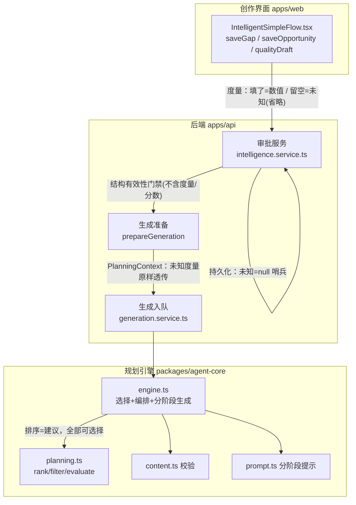
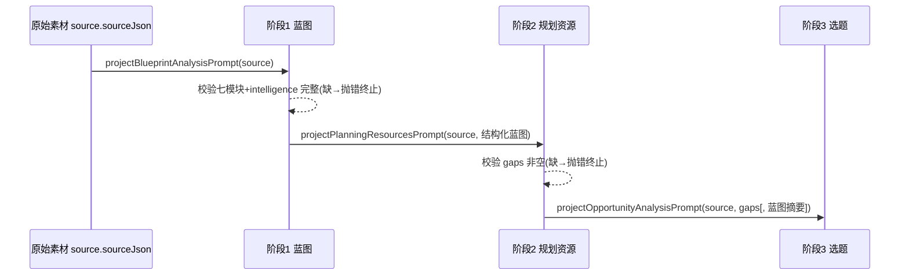

# 设计文档：内容方法论自洽性修复

## 文档状态

- **功能名称**：`content-methodology-self-consistency`
- **工作流**：需求优先（Requirements-First）·当前阶段：设计（Design）
- **范围锁定**：仅 A 类"方法论自洽性"修复（M2、M3、M6、M7、M10）；**不触碰** B 类工程缺陷（由独立 spec 覆盖），本文不引用其内容。
- **命名基准**：与 `requirements.md` 术语表一致（系统 / 审批服务 / 生成准备 / 规划引擎 / 机会排序启发式 / 项目分析 / 分析阶段 / 评论编排 / 性能度量 / 未知度量 / 结构有效性 / 预测表现 / 硬门禁 / 建议信号 / 禁止声明 / 证据落地 / 蓝图完整性 / 有效输出）。
- **校验命令**（均在 `content-agent/` 下执行）：`npm run typecheck`、`npm test`、`npm run build`。

---

## Overview（概述）

系统对外主张"认知诚实"：不把未知伪装成已知，不把未标定的估计当作权威裁决。端到端评审发现五处方法论自相矛盾，本设计逐一落地到 `content-agent` 真实代码：

| 线程 | 症结（现状代码） | 修复方向 |
|---|---|---|
| **M10（需求 1）** | `intelligence.service.ts` 的 `opportunityMetricReview` 把"度量未填"强制改写为 `status:'unknown'`，使**预测表现**（性能度量）反向决定**结构有效性**（资格/审批）。 | 定义两组互不推导、互不覆盖的独立字段：`Structural_Validity`（硬门禁）与 `Predicted_Performance`（建议）。这是 M2/M3 的地基。 |
| **M2（需求 2/3/4）** | 后端 `assertResourceMetricsReady`、`assertOpportunityReviewFields`、`assertOpportunitySelectable`、`prepareGeneration` 把"度量缺失"当硬门禁；前端 `saveGap`/`saveOpportunity`/`qualityDraft` 在留空时注入 `0.5`/`0.3`。 | 让**未知度量**以可空/哨兵语义端到端贯穿（提交→DTO/持久化→审批→生成准备→规划引擎）；逐一放开度量门禁；前端停止默认注入；明确保留全部真正硬门禁。 |
| **M3（需求 5）** | `planning.ts` 的 `filterTopicOpportunities`（F39 门禁）用 `minProofability`/`maxRisk` 筛除选题；`evaluateOpportunity` 把阈值违背写入 `hardReasons`→`ineligible`；`engine.ts` 选择时 `find(effectiveEligibility==='eligible' && finalScore!==null)` 会丢弃未知/低分选题。 | 把未标定启发式降级为**建议信号**：仅排序与提示，阈值降级为排序输入；保持全部候选可选择。 |
| **M6（需求 6）** | `analyzeProject` 三次 LLM 调用中，阶段 1（蓝图）与阶段 2（规划资源）各自从同一 `source.sourceJson` 独立推导；蓝图完整性校验发生在三阶段全部跑完之后。 | 串联：阶段 2 消费阶段 1 的结构化蓝图输出、阶段 3 消费阶段 2 输出；前阶段缺必需内容即刻报错终止（不以空输入继续）。 |
| **M7（需求 7）** | 评论编排机制（persona-scene / dialoguePlans / discoveryPlan / densityProxy / conversationPlan / 多轮 growth）高度精细，缺乏证据证明复杂度必要。 | 逐机制判定证据/价值，给出**克制收敛**：无据机制降级为可选或特性开关关闭，并严格保证"收敛前有效输出仍有效、管线仍可运行"。 |

**贯穿性设计原则**：结构有效性（可硬性校验）与预测表现（未标定估计）是两条正交的轴。阻断只能来自结构有效性轴；预测表现轴（含机会排序启发式分数与七项/三项度量）永远只作参考。M10 建立这条分界，M2/M3 分别在"度量"与"排序分数"两个维度落实它，M6/M7 在这条纪律下分别提升连贯性与节俭度。

---

## Architecture（架构）

### 受影响的模块与数据流



### 分层职责（与需求 1 的分界一致）

- **结构有效性轴（硬门禁，可阻断）**：`审批服务` 与 `生成准备` 内的禁止声明、证据落地、蓝图完整性、结构完整性（缺口引用/依赖新鲜度）、`status==='blocked'`。这些**不读取**度量数值与排序分数。
- **预测表现轴（建议，不可阻断）**：性能度量（gap 三项、opportunity 七项、image 三项）与 `机会排序启发式` 分数。允许取值为**未知度量**；未知不改变任何门禁结论。

### 研究性说明（本设计沿用的既有事实，无需新增外部依赖）

- 后端持久层**已经**用 `optionalRatio()` 把非数值/越界输入折叠为 `null`，`canonicalOpportunityData` 把 `null` 度量按原样写回（不填默认值）。因此"未知=null"的**表示能力已存在**；本设计的工作量集中在**门禁判定**与**前端默认注入**，而非新造存储格式。这一发现直接收窄了 M2 的改动面。
- `OpportunityRankHeuristicV1` 描述符**已经**带 `weightsCalibrated:false / causal:false / notF28:true / scoreSemantics:'ordinal_noncausal_heuristic'`，前端 `OpportunityRankDisclosure` 也已展示未标定状态。M3 的工作量集中在**把阈值/分数从门禁改为排序输入**，披露层复用既有实现。
- 评论编排的多数机制**已经**是"警告级"或带 `try/catch` 优雅降级（如 `comment_reply_plan_missing`、`comment_discovery_plan_missing` 是 `warning`；stage 2B growth 失败仅 push `model_comment_growth_failed` 警告并保留根评论）。这决定了 M7 可以在**不破坏有效输出**的前提下做收敛。

---

## Components and Interfaces（组件与接口）

> 每条线程给出：改动位置（文件·函数）→ 改法 → 保持不变项。

### 组件 A · M10：分离"结构有效性"与"预测表现"（需求 1）

**位置**：`apps/api/src/intelligence.service.ts`

**核心改动 —— 解开 `opportunityMetricReview` 的耦合**（当前它把度量缺失反向写入资格状态）：

```ts
// 现状（问题）：度量未填 → status 被强制改写为 'unknown'
return {
  metrics,
  status: unknownMetrics.length ? 'unknown' : requestedStatus, // ← 预测表现覆盖结构有效性
  unknownMetrics,
};
```

改为**两轴独立**：

```ts
// 目标：resolvedEligibility（结构轴）与 metricStatus（预测轴）互不推导
return {
  metrics,                                   // 预测表现：数值或 null(未知)
  metricStatus: unknownMetrics.length ? 'unknown' : 'complete', // 预测轴独立字段
  unknownMetrics,
  eligibility: requestedStatus,              // 结构轴：用户断言的 eligible/blocked/unknown，不被度量改写
};
```

- `canonicalOpportunityData`：`status`（→ 重命名语义为"资格/结构有效性状态" `eligibility`）不再由 `review.unknownMetrics` 决定；`metricStatus`/`unknownMetrics`/`reviewRequired` 保持为**独立**的预测表现描述字段。`score` 依旧仅在结构有效且用户提供了数值时透出，未知时为 `null`（既有行为，符合"未知不补零"）。
- `normalizeOpportunity` / `normalizeGap` / `normalizeImageAnalysis`：输出对象中，结构字段（`eligibility`/`status`、`gapIds`、依赖快照相关）与预测字段（度量、`metricStatus`、`unknownMetrics`）分列，**互不覆盖**；任一预测字段缺失不改变结构字段取值（需求 1.2）。

**呈现层标识（需求 1.5）**：`mapOpportunity` 输出继续携带 `rankInputSources`、`heuristic`（含 `weightsCalibrated:false`）、`scoreSemantics`，前端据此标注"参考、非授权依据"。此处复用既有 `opportunityRankAudit` 字段，无需新增结构。

**保持不变**：结构有效性的判定集合（禁止声明、证据落地、蓝图完整性、缺口引用、依赖新鲜度、blocked）。

---

### 组件 B · M2：未知度量端到端表示 / 持久化 / 审批 / 消费（需求 2/3/4）

#### B1. 未知度量的类型表示（贯穿全链路）

- **规范表示**：`number | null`（持久层）与 `number | undefined`（内存/规划层）二者等价表示"未知度量"；**禁止**用 `0`、`0.5`、`0.3`、中位值或任何默认值表示未知。
- 后端 `optionalRatio()` 已把缺失/非法/越界折叠为 `null`（保留）；`planning.ts` 的 `metricValue()` 已把非有限/越界折叠为 `undefined`（保留）。二者构成"未知度量"的两端表示，本设计不改其语义，只确保门禁不再因 `null/undefined` 抛错。

#### B2. 逐一列出要放开的度量门禁（改为允许未知放行）

| # | 位置（文件·函数） | 现状（阻断） | 改法（允许未知放行） |
|---|---|---|---|
| 1 | `intelligence.service.ts · assertResourceMetricsReady`（`information_gaps` 分支） | `importance/decisionLeverage/proofability` 任一为 `null` 即 `throw BadRequestException` | **删除该度量完备性校验**（gap 分支整体移除度量必填）；未知度量放行。 |
| 2 | `assertResourceMetricsReady`（`image_analysis_versions` 分支） | `clarity/relevance/textLegibility` 任一 `null` 即抛错 | 同上，移除图片质量度量必填；未知放行。 |
| 3 | `assertOpportunityReviewFields` | `unknownMetrics.length` 即抛"需先补齐度量" | 移除"未知度量→抛错"分支；**仅保留** `status==='blocked'→抛错` 与 `status!=='eligible'→抛错`（结构轴）。 |
| 4 | `assertOpportunitySelectable` | 依赖 `ranked.reviewRequired`/`effectiveEligibility==='review_required'`（由未知度量/不可溯源触发）抛错 | 不再因"未知度量导致的 review_required"阻断；仅当 `effectiveEligibility` 因**结构原因**（blocked/空 topic/空 gapIds）为 `ineligible` 时阻断。 |
| 5 | `prepareGeneration` | 对 gaps、image analyses 调用 `assertResourceMetricsReady`；对 opportunity 调用 `assertOpportunityReviewFields` | 因 1–3 的改动自动放行未知度量；生成准备继续执行（需求 2.5）。 |
| 6 | `approveResource`（通用审批） | `if (requested==='approved') assertResourceMetricsReady(...)` | 因 1–2 改动，gap/image 审批不再因未知度量被阻断（需求 2.3）。 |

#### B3. 明确保持不变的硬门禁（需求 3，一字不动）

以下门禁**不因存在未知度量而豁免/跳过/放松**（需求 3.9），且命中即拒绝并返回原因（需求 3.8）：

- **禁止声明**（需求 3.1/3.6/3.10）：`assertOpportunityReviewFields` 的 `status==='blocked'→阻断审批`；`prepareGeneration` 中 blocked 选题阻断生成；`content.ts` 中 `claimPolicy` 受控声明校验（`fabricated_operational_experience`、受控 claim 无证据等）。
- **证据落地**（需求 3.2）：`content.ts` 的 `thread_evidence_ledger_mismatch`、`verified_claim_without_evidence`、`verified_thread_claim_not_mapped` 等 `error` 级校验；`bindDialogueProvenance` 的证据绑定。
- **蓝图完整性**（需求 3.3）：`selectOpportunity`/`prepareGeneration` 中 `PROJECT_BLUEPRINT_MODULE_KEYS` 七模块全审批检查、`approvedProjectBlueprint` 的 `projectBlueprintCompleteness`。
- **结构完整性**（需求 3.4/3.5）：`selectOpportunity` 的"至少引用一个已审批且启用缺口"、`assertOpportunityDependenciesCurrent` 的依赖快照新鲜度校验。
- **仅移除"强制编造数值度量"**（需求 3.7）：B2 只删度量完备性门禁，不动上述任何一项。

#### B4. 前端停止默认注入（需求 4）

**位置**：`apps/web/src/pages/IntelligentSimpleFlow.tsx`

- `saveGap`：删除 `importance ?? 0.5 / decisionLeverage ?? 0.5 / proofability ?? 0.3` 注入。留空字段**不写入该键**（提交为未知）；用户显式设置的 `0..1` 值原样提交（需求 4.2/4.5）。
- `saveOpportunity`：删除七项 `?? 0.5 / ?? 0.3` 注入与 `eligibilityStatus || 'eligible'` 的隐式兜底；留空即未知（需求 4.3）。资格状态由用户显式选择（eligible/blocked/unknown），不因度量留空被改写。
- `qualityDraft` 初值与 `openQualityEditor`/`approveAsset`/`saveQuality`：不再以 `0.5` 预填；未填的质量度量提交为未知（需求 4.4）。将滑杆型输入改为"可清空/未设置"三态控件（未设置=未知）。
- `approvePlanningResources` 的 `gapMetricsMissing` 前置拦截：**移除**（不再要求补齐度量才能确认）。
- 未知呈现（需求 4.6）：度量为未知时显示"未知/待复核"，复用既有 `resolveOpportunityRankView` 的 `unknown` 分支与 `unknownMetrics` 展示，不显示为 `0`/默认值。
- 无效输入（需求 4.7）：非数值或越界时不提交该值、不以默认替代，并就地提示更正（前端 `Field` 校验 + 后端 `optionalRatio` 二次防御）。

#### B5. 既有 0.5/0.3 历史数据处理策略

- **读取即解释，不做破坏性迁移**：已持久化的数值（含历史上由默认注入写入的 `0.5/0.3`）在数据层与"用户真实输入的 0.5/0.3"不可区分，故**保留原值并按已知数值解释**（`optionalRatio` 原样返回）。这是"不再制造新的虚假确定性"的务实选择：不追溯改写既有记录，但从此刻起留空一律为未知。
- **可选的软重评**（非破坏性、默认关闭）：对 `rankInputSources.metrics[*].source === 'model_heuristic'` 的模型草案度量，前端已标注"未标定启发"；用户重新编辑保存时按 B4 规则处理（留空→未知）。不提供批量清零脚本，避免误伤真实录入。

---

### 组件 C · M3：机会排序启发式仅作建议，不作门禁（需求 5）

**位置**：`packages/agent-core/src/planning.ts`、`packages/agent-core/src/engine.ts`

#### C1. `filterTopicOpportunities`（F39 门禁）降级为结构过滤

现状按 `proofability >= minProofability && risk <= maxRisk` 筛除：

```ts
return opportunity.status === "eligible"
  && proofability !== undefined && proofability >= thresholds.minProofability   // ← 预测阈值当门禁
  && risk !== undefined && risk <= thresholds.maxRisk                           // ← 预测阈值当门禁
  && opportunity.topic.trim().length > 0
  && opportunity.gapIds.length > 0;
```

改为**只保留结构条件**（阈值不再参与可选择性）：

```ts
return opportunity.status !== "blocked"        // 结构：blocked 不可选
  && opportunity.topic.trim().length > 0       // 结构：有主题
  && opportunity.gapIds.length > 0;            // 结构：有缺口引用
// proofability / risk 阈值不再在此筛除（需求 5.3/5.4）
```

> 语义变化：`filterTopicOpportunities` 从"可行性门禁"变为"结构可选择性过滤"。未知度量（`undefined`）不再被排除。

#### C2. `evaluateOpportunity`：阈值从 `hardReasons` 移到排序输入

- 从 `hardReasons` 中**移除** `proofability < minProofability`、`risk > maxRisk` 两条；`hardReasons` 只保留结构原因（`status==='blocked'`、空 topic、空 gapIds）。
- `effectiveEligibility` 的判定：`ineligible` 仅由结构 `hardReasons` 触发。**未知度量与不可溯源**继续记录在 `reviewReasons`/`unknownMetrics`（作为**提示**），但**不**再使任何选题从"可选择"降为"不可选择"——即 `review_required` 是提示态，不是门禁态。
- `minProofability`/`maxRisk` 作为**排序输入**：在打分或提示文案里体现（如低于建议阈值时给出 `advisoryNote`），但不参与可选择性判定（需求 5.4）。

#### C3. `engine.ts · resolveGenerationPlanning`：选择保留全部可选择性

- **显式锁定路径**（`planning.selectedOpportunityId`）：现状 `if (!filterTopicOpportunities([selected], ...).length) throw "not feasible"`。因 C1 改动，阈值不再触发"not feasible"；仅当选题结构不合法（blocked/空 topic/空 gapIds）才拒绝。已审批锁定选题不因未标定阈值被阻断（需求 5.7）。
- **启发式排序路径**（`suppliedOpportunities.length`）：现状 `ranked.find(effectiveEligibility === "eligible" && finalScore !== null)` 会丢弃未知/低分选题。改为：在**结构可选择**（非 blocked、有 topic、有 gapIds）的集合内，按 `rank`（排序名次）取首个作为默认选择；`finalScore` 为 `null`（因未知度量）**不**排除候选（需求 5.2/5.3）。排序仅决定"默认呈现顺序/默认选择"，不决定"是否可被选择"。

#### C4. 披露（需求 5.1/5.5/5.6）

- `OpportunityRankHeuristicV1` 描述符已含 `weightsCalibrated:false` 等（保留，需求 5.1）。
- 前端 `OpportunityRankDisclosure` / `opportunity-rank.ts` 已展示未标定状态与"非平台效果/阅读量/转化预测"的说明（保留，需求 5.5/5.6）。本设计确保排序分数不进入任何门禁（需求 5.7）：审批/生成判定路径（组件 A/B 的结构门禁）不读取 `finalScore`/`baseScore`。

**保持不变**：`OpportunityRankHeuristicV1` 权重与语义、结构距离/覆盖签名逻辑、`planTopicOrchestrations` 的三方案契约。

---

### 组件 D · M6：串联三阶段项目分析（需求 6）

**位置**：`apps/api/src/intelligence.service.ts · analyzeProject`，及 `prompt` 构造函数 `projectPlanningResourcesPrompt` / `projectOpportunityAnalysisPrompt`

#### D1. 数据流改造（阶段串联）



- **阶段 2 消费阶段 1**（需求 6.2）：`projectPlanningResourcesPrompt(sourceJson)` 增加入参，注入阶段 1 已产出的结构化蓝图（`intelligence` 摘要 + 七个 `blueprintModules` 的 `domain_model.decisionTasks`/`audience_model.states`/`claim_policy` 等），作为规划资源阶段的输入上下文。
- **阶段 3 消费阶段 2**（需求 6.3）：`projectOpportunityAnalysisPrompt(sourceJson, planningGaps)` 已接收阶段 2 的 `gapCatalog`（保留）；补充阶段 2 的 `expressionStrategies` 摘要作为选题上下文，使选题建立在规划资源之上。
- **固定顺序、不跳阶段**（需求 6.1）：`analyzeProject` 已按 蓝图→规划→选题 顺序 `await`，保留。

#### D2. 前阶段缺必需内容即刻报错终止（需求 6.6）

- **蓝图完整性前移**：现状 `missingBlueprintModules` 检查在三阶段全部完成之后。改为在**阶段 1 完成后、阶段 2 开始前**校验 `intelligence` 与七模块齐全；缺失则 `throw AnalysisGatewayError('...omitted required project blueprint modules: <names>')` 终止，**不**以空蓝图进入阶段 2。
- **规划资源非空校验**：阶段 2 完成后、阶段 3 开始前，若 `planningGaps` 为空（阶段 3 的必需输入）则抛错终止，不以空 gap 目录继续。
- 错误信息必须指明缺失内容（模块名 / "informationGaps 为空"）。

**保持不变**（需求 6.4/6.5）：每阶段产物仍各自以 `draft` 落库并要求**独立审批**（`insertBlueprintModule`/`insertAnalyzedGap`/`insertAnalyzedStrategy`/`insertAnalyzedOpportunity` 均写 `status='draft'`）；下游依赖的输出 schema（`blueprintModules` 七键、gap/strategy/opportunity 的 JSON 形状）不变；三阶段各自的重试与缓存（`retryAnalysis`/`cachedTask`）不变。

---

### 组件 E · M7：收敛评论网络复杂度（需求 7）——核心开放决策

**位置**：`packages/agent-core/src/planning.ts`（`buildPersonaScenePlan`/`dialoguePlans`）、`content.ts`（校验）、`prompt.ts`（`buildStagedCommentsPrompt`/`buildStagedCommentGrowthPrompt`）、`engine.ts`（分阶段编排）

#### E1. 逐机制判定表（证据 a / 创作价值 b / 皆无 c）

| 机制 | 现状角色 | 证据(a) | 创作价值(b) | 判定 | 收敛动作 |
|---|---|---|---|---|---|
| **persona-scene**（`buildPersonaScenePlan`：commentCast / commentNetwork / surfaceTargets / crossChannelRules） | 喂入分阶段提示；驱动跨通道一致性与角色接地安全校验 | 部分(a)：commentCast/commentNetwork 由**已审批** `projectBlueprint.role_model/scenario_model/surface_language` 派生 | 是(b)：跨通道一致性、反销售剧本、角色只说其位置能知道的内容（有记录依据） | **必需保留** | 不降级。移除会破坏提示输入与结构有效性（跨通道一致性/角色接地），命中需求 7.7。 |
| **dialoguePlans / dialogueThreads**（线程规划、primaryGapId、auxiliaryGapIds） | 产出线程结构与缺口去向，喂 `gapCoverageLedger` | 部分(a)：缺口来自已审批信息缺口 | 是(b)：缺口覆盖台账、required 缺口不静默丢失 | **必需保留** | 不降级。`gapCoverageLedger` 属结构有效性（`comment_gap_silently_dropped` 为 error）。 |
| **gapCoverageLedger** | required 缺口去向审计 | (a) | 是(b) | **必需保留（结构有效性）** | 不降级。 |
| **replyPlan**（directAnswer/condition/boundary/unknown/nextQuestion） | 承载答复要件与边界；缺失仅 `warning` | 弱 | 是(b)：边界/未知声明有安全价值 | **保留但已非阻断** | 维持警告级；作为答复要件模板保留。 |
| **discoveryPlan**（cue/inferencePrompt/reveal/selfCheck/difficulty/revealTiming） | `personaQuestion` 生成（当 `commentDiscoveryStrength>=50`）；缺失仅 `warning` | **无(a)**：难度/揭示时机框架无证据 | 部分(b)：其派生的**安全校验**（不扣留信息、不伪闭合、发现感≠证据）有价值，但**结构本身**冗余 | **(c) 结构冗余 → 降级为可选** | 结构降级为可选（本已 warning）：`dialoguePlans` 不再强制产出完整 discoveryPlan；**保留** `content.ts` 中 `comment_discovery_withholding`/`comment_discovery_false_closure`/`comment_discovery_as_evidence` 三条安全校验（当 discoveryPlan 存在时生效）。 |
| **densityProxy**（primaryGapCount=1 / expectedReplyComponents=5 / 各计数） | 与 roleCard+primaryGapId 组成"密度契约"，`comment_density_proxy_mismatch` 为 error | **无(a)**：`expectedReplyComponents=5` 等常量无证据 | 弱(b)：自描述审计，但真正约束是"缺口多路复用上限" | **(c) → 降级为可选/派生** | 解除"密度契约"强绑定：将 `hasDensityContract` 判据由 `roleCard || primaryGapId || densityProxy` 改为 `roleCard || primaryGapId`；densityProxy 变为**可选审计字段**（存在才校验一致性）。**保留** `comment_gap_multiplexing_exceeded`（真正的结构约束）。 |
| **conversationPlan**（topology/targetFollowUps/moves） | 由实际 followUps 数在 `engine.ts` **派生**；无 error 级校验 | 无(a) | 弱(b)：描述会话形态 | **保留为派生、非必需** | 低成本、已从实际结果派生，维持现状（不额外强制）。 |
| **多轮 growth（stage 2B `buildStagedCommentGrowthPrompt`）** | **额外一次 LLM 调用**；失败仅 `warning`（根评论保留） | **无(a)**：多轮提升效果无证据 | 部分(b)："自然评论区"真实感（有记录理由）；但**有成本** | **(c/b) → 特性开关，默认保守** | 以特性开关/参数控制：当 `followUpDepth===0` 或会话率为 0 时**跳过 stage 2B**；默认走保守档。已有 try/catch 优雅降级，跳过不影响有效输出。 |

#### E2. 推荐方案（请评审时据此拍板力度）

**推荐"中等偏保守"收敛**：

1. **discoveryPlan → 可选**：`dialoguePlans` 允许产出精简形态（仅保留 `boundary` 语义所需字段，其余可空）；`content.ts` 对其缺失维持 `warning`（不阻断），对其**存在时**的三条安全校验保留为 `error`。
2. **densityProxy → 可选审计**：解除与 roleCard/primaryGapId 的强绑定，`comment_density_metadata_incomplete` 不再因缺 densityProxy 触发；真正约束由 `comment_gap_multiplexing_exceeded` 承担。
3. **多轮 growth → 特性开关（默认保守）**：新增/复用生成参数（如 `commentConversationRate`/`followUpDepth`）作为开关；为 0 时跳过 stage 2B 这次额外 LLM 调用，直接用根评论产出有效输出。
4. **persona-scene / dialoguePlans / gapCoverageLedger / 安全校验 → 全部保留**（结构有效性与安全，命中需求 7.7 必需项）。

**取舍**：牺牲 discoveryPlan/densityProxy 的"审计精细度"和多轮 growth 的"默认真实感"，换取更少的无据复杂度与更低的生成成本；三者被降级后，**收敛前的有效输出仍有效**（因其原本就是 warning 级或有优雅降级），**管线仍可运行**（需求 7.3/7.4/7.5）。

#### E3. 被否决的备选方案与理由

- **A：完全移除 persona-scene** —— 否决。提示层（`buildStagedCommentsPrompt` 依赖 `commentCast/commentNetwork/surfaceTargets`）与跨通道一致性、角色接地安全校验都依赖它；移除会使有效输出失效并削弱安全（违反 7.4/7.7）。
- **B：移除 gapCoverageLedger** —— 否决。它是结构有效性（`comment_gap_silently_dropped` 为 error），移除等于放弃"required 缺口不静默丢失"这一硬保证。
- **C：彻底删除多轮 growth（而非开关）** —— 否决（改为开关）。多轮有"有记录依据的创作价值"，且已有优雅降级；用特性开关更克制、可逆，满足 7.5 又不违反 7.2。
- **D：维持现状不收敛** —— 否决。违反需求 7.1（必须减少无证据支撑的复杂度）。

#### E4. 判定记录（需求 7.6）

E1 判定表即为"每机制一项判定 + 依据"的落地形式；实现时以代码注释/该 design.md 表格作为可保留的判定依据来源。

**贯穿约束校验（需求 7.3/7.4/7.5/7.7）**：所有降级项在收敛前均为 warning 级或带优雅降级，故对"收敛前可产出的有效输出"，收敛后：管线仍完成、输出仍满足结构有效性；被降级机制在正式生成中缺席时仍产出有效输出；而 persona-scene/dialoguePlans/gapCoverageLedger 因其缺席会破坏有效输出或管线，故保留为必需项。

---

## Data Models（数据模型）

### 1. 两轴独立字段（M10 地基）

**结构有效性（Structural_Validity）—— 硬门禁，可阻断**

| 字段 | 载体 | 语义 |
|---|---|---|
| `eligibility`（选题，原 `status`） | `topic_opportunities.data_json` | `eligible` / `blocked` / `unknown`；**由用户/分析显式断言**，不被度量改写 |
| `gapIds` / 缺口引用完整性 | 同上 | 结构完整性：≥1 已审批且启用缺口 |
| `dependencySnapshot` | 同上 | 依赖新鲜度快照（gaps/blueprint/strategy 的 contentRevision+approvedAt） |
| 蓝图七模块审批态 | `project_blueprint_modules.status` | 蓝图完整性 |
| 证据落地/禁止声明结果 | `content.ts` 校验产出 | 生成期结构有效性 |

**预测表现（Predicted_Performance）—— 建议，不可阻断，允许未知**

| 字段 | 载体 | 未知表示 |
|---|---|---|
| gap 三项：`importance`/`decisionLeverage`/`proofability` | `information_gaps.data_json` | `null`(持久) / `undefined`(内存) |
| opportunity 七项：`relevance`/`importance`/`proofability`/`decisionLeverage`/`novelty`/`cognitiveCost`/`risk` | `topic_opportunities.data_json` | 同上 |
| image 三项：`clarity`/`relevance`/`textLegibility` | `image_analysis_versions.observation_json` | 同上 |
| `metricStatus` / `unknownMetrics` / `reviewRequired` | 各资源规范化输出 | 预测轴的**独立描述**字段（不改结构轴） |
| 机会排序启发式 `finalScore`/`baseScore`/`components` | `rankTopicOpportunities` 产出 | `null` 表示因未知度量无法打分 |

**独立性约束（需求 1.2）**：结构轴与预测轴分列于同一 `data_json` 但互不推导；`opportunityMetricReview` 不再用 `unknownMetrics` 覆盖 `eligibility`；任一预测字段缺失/变更不改变结构字段的持久化取值。

### 2. 未知度量哨兵（M2）

- 持久层：`optionalRatio(x)` → `number | null`；`null` = 未知度量（禁止折叠为 0/0.5/0.3）。
- 规划层：`metricValue(x)` → `number | undefined`；`undefined` = 未知度量。
- 前端提交：留空字段**省略该键**（而非写默认值），后端接收缺键 → `optionalRatio(undefined)=null`。

### 3. 机会排序审计（M3，复用既有）

`RankedTopicOpportunity`：`heuristic`(含 `weightsCalibrated:false`)、`components`、`baseScore`/`finalScore`(可 `null`)、`effectiveEligibility`、`reviewReasons`、`policy`(阈值快照)。M3 后 `effectiveEligibility` 的 `ineligible` 仅由结构原因产生；阈值降为 `policy` 排序输入与 `advisoryNote`。

### 4. 三阶段串联输入（M6）

- 阶段 2 提示新增入参：阶段 1 的 `{ intelligence 摘要, blueprintModules 七键结构化摘要 }`。
- 阶段 3 提示入参：阶段 2 的 `{ gapCatalog, expressionStrategies 摘要 }`（gapCatalog 已存在）。
- schema 不变；仅"上一阶段结构化输出"作为下一阶段的输入上下文注入。

### 5. 评论编排契约（M7）

- `discoveryPlan`、`densityProxy` 由"必需"降为"可选字段"（类型上以可选/可空表达）；`conversationPlan` 维持派生。
- `hasDensityContract` 判据收敛为 `roleCard || primaryGapId`。
- 多轮 growth 由生成参数开关控制是否发起 stage 2B。

---

## Correctness Properties（正确性属性）

*属性（property）是系统在所有有效执行下都应成立的特征或行为——即对系统"应当做什么"的形式化陈述。属性是人类可读规格与机器可验证正确性保证之间的桥梁。*

本节属性均经"验收标准可测性预分析（prework）"与属性反思去冗余后得出。每条属性均为全称量化（"对任意…"），并标注其验证的需求条款。可测但更适合示例/边界的验收标准（1.1、1.5、3.3、3.4、3.5、3.7、4.6、4.7、5.1、5.5、5.6、6.1–6.5、7.1、7.2、7.6、7.7）在"Testing Strategy"中以单元/示例测试覆盖，不重复列为属性。

### Property 1：结构有效性与预测表现字段相互独立

*对任意*资源（信息缺口 / 选题 / 图片观察）及其任意的预测表现字段改动（置为未知、改为任意合法数值、或删除），该资源的结构有效性字段（选题 `eligibility`/`status`、`gapIds`、依赖快照、蓝图/审批相关状态）的持久化取值保持逐字不变；反之，对结构字段的改动也不改变预测字段的持久化取值。

**Validates: Requirements 1.2**

### Property 2：未知度量往返保真

*对任意*度量输入，若其在提交时为未知（留空 / 非数值 / 越界），则经"提交 → DTO → 持久化 → 读取 → 传递规划引擎"的每一环节后仍表示为未知度量（持久层 `null` / 内存层 `undefined`），且在任一环节都不等于 `0`、`0.5`、`0.3`、中位值或任何默认值。

**Validates: Requirements 2.1, 2.2, 2.6, 2.8**

### Property 3：未知度量不改变硬门禁结论

*对任意*资源，将其任意一组预测表现度量由已知置为未知（或反之），审批与生成的硬门禁判定结果（阻断 / 放行 及其命中的门禁集合）保持不变：即当资源除度量未知外满足全部硬门禁时恒被放行，而当资源违反某硬门禁时，附加未知度量不使其获得豁免。

**Validates: Requirements 1.3, 1.6, 2.3, 2.4, 2.5, 2.7, 3.9**

### Property 4：排序分数不作为门禁依据

*对任意*选题，改变或移除其机会排序启发式分数（`finalScore`/`baseScore`/`components`），其审批授权与生成门禁的结论保持不变。

**Validates: Requirements 1.4, 5.7**

### Property 5：前端留空即未知、填值即原样、绝不注入默认

*对任意*度量字段的任意"留空子集"，创作界面构造的提交载荷对每个留空字段均不含数值（作为未知度量提交）；而对每个用户显式输入且落在 `0..1` 的字段，载荷中的取值与用户输入逐一相等，不被默认值或未知替代。

**Validates: Requirements 4.1, 4.2, 4.3, 4.4, 4.5**

### Property 6：保留的硬门禁恒阻断且命中即拒绝

*对任意*包含禁止声明（`status==='blocked'` 或受控声明无证据）、或含被当作事实但不满足证据落地的声明的资源/草案，审批服务与生成准备恒阻断对应操作，且命中时拒绝该操作、不产生也不持久化任何审批结果或生成输出，并返回指明所命中硬门禁的原因。

**Validates: Requirements 3.1, 3.2, 3.6, 3.8, 3.10**

### Property 7：候选可选择性在排序下守恒

*对任意*候选选题集合（含未知度量、极端高/低分数、任意阈值配置），规划引擎排序后的可选择集合恰为输入中结构可选择（非 blocked、有主题、有缺口引用）选题的一个置换——排序仅改变呈现顺序与提示，绝不因分数、度量取值（高/低/缺失/未知）或阈值（minProofability/maxRisk）移除任何选题。

**Validates: Requirements 5.2, 5.3, 5.4**

### Property 8：三阶段串联缺必需内容即刻报错终止

*对任意*前一分析阶段的结构化输出，若其缺少下一阶段 schema 所要求的必需内容（如蓝图七模块任一缺失、或规划资源阶段 `informationGaps` 为空），项目分析恒以指明缺失内容的错误终止，且不以空输入发起后续分析阶段调用。

**Validates: Requirements 6.6**

### Property 9：评论编排收敛保持有效输出与管线可运行

*对任意*在收敛前可成功产出有效输出的规划输入，评论编排复杂度收敛后：内容生成管线仍完成生成流程且不发生错误终止，收敛前的该份有效输出仍满足结构有效性校验；并且当正式生成省略被降级为非必需的机制（discoveryPlan / densityProxy / 多轮 growth）时，仍能完成并产出满足结构有效性的有效输出。

**Validates: Requirements 7.3, 7.4, 7.5**

---

## Error Handling（错误处理）

### 门禁拒绝的可观测契约（需求 3.8）

命中任一硬门禁时，遵循既有 `BadRequestException`/`AnalysisGatewayError` 机制：

- **审批服务**：`assertOpportunityReviewFields`（blocked/非 eligible）、`selectOpportunity`（缺口未审批、蓝图未全审批）、`assertOpportunityDependenciesCurrent`（依赖快照过期）抛 `BadRequestException`，事务不提交，**不写入** `status='approved'`，错误信息指明门禁（如 `The topic opportunity is blocked and cannot be approved.`）。
- **生成准备/入队**：`prepareGeneration` 抛错时 `generation.service.create` 不插入 `generation_jobs` 记录（拒绝早于入队），无生成输出被持久化。
- **原则**：拒绝路径必须"抛错在持久化之前"，保证需求 3.8 的"不产生也不持久化任何结果"。

### 未知度量放行（非错误路径）

- 度量为未知不再触发异常；`assertResourceMetricsReady` 的度量分支移除后，未知度量沿正常路径流转。前端对未知度量以"待复核"提示（非错误 toast）。

### 三阶段 fail-fast（需求 6.6）

- 阶段 1 后蓝图不完整 → `AnalysisGatewayError('The analysis model omitted required project blueprint modules: <names>.')`，经 `failTask` 记为 `failed`，**不**发起阶段 2/3 调用。
- 阶段 2 后 `informationGaps` 为空 → 抛错终止，不发起阶段 3。
- 既有 `retryAnalysis` 重试与 `onModuleInit` 的中断恢复逻辑不变。

### 评论编排降级（需求 7，非错误）

- 多轮 growth（stage 2B）失败或被开关跳过：沿用既有 `try/catch`，push `model_comment_growth_failed`（`warning`，`repairable:false`），保留根评论，管线继续。
- `discoveryPlan`/`densityProxy` 缺失：维持 `warning` 级（`comment_discovery_plan_missing`/移除 `comment_density_metadata_incomplete` 的强制），不阻断。
- 生成期 `error` 级安全校验（证据落地、禁止声明、伪造经历、缺口静默丢失）保持 `error` 并驱动 `maxRepairAttempts` 修复循环。

### 无效度量输入（需求 4.7）

- 前端：非数值/越界不提交该值，就地提示；后端 `optionalRatio` 二次防御折叠为 `null`（未知），不落库为非法数值。

---

## Testing Strategy（测试策略）

### 双轨测试

- **单元/示例测试**：覆盖具体门禁场景、装配连线、边界与展示（对应 prework 中 EXAMPLE/EDGE_CASE 的验收标准）。
- **属性测试**：覆盖 Property 1–9 的全称不变式。二者互补：单元测试抓具体缺陷，属性测试验证跨输入的普遍正确性。

### 适用性判定与库选型

本功能核心逻辑（度量规范化 `optionalRatio`/`metricValue`、`opportunityMetricReview`/`canonicalOpportunityData`、`rankTopicOpportunities`/`filterTopicOpportunities`、`validateGenerationDraft`、确定性生成管线）均为**纯函数或清晰输入/输出**且存在大输入空间的**不变式**，PBT 适用。

- **库**：`fast-check`（TypeScript 生态标准，作为 devDependency 加入 `packages/agent-core` 与 `apps/api`；不从零自研 PBT）。
- **运行器**：`agent-core` 用 `vitest`（现状），`apps/api` 用 `node:test`（现状）；`fast-check` 与二者均兼容（属性以断言循环形式运行）。
- **迭代数**：每条属性测试 `fc.assert(fc.property(...), { numRuns: 100 })`，最少 100 次随机迭代。
- **标注**：每条属性测试注释 `// Feature: content-methodology-self-consistency, Property {n}: {属性标题}`，并以单一属性测试实现对应属性。

### 属性 → 实现位置映射

| 属性 | 主要被测 | 位置 | 生成器要点 |
|---|---|---|---|
| P1 字段独立 | `canonicalOpportunityData`/`normalizeOpportunity`/`normalizeGap`/`normalizeImageAnalysis` | `apps/api`（node:test + fast-check） | 随机资源 × 随机预测字段置空/改值；断言结构字段快照不变 |
| P2 未知往返 | `optionalRatio`/`prepareGeneration`/`hydratePlanningContext` | `apps/api` | 随机未知/合法/越界度量；断言各环节仍为未知 |
| P3 未知不改门禁 | `assertResourceMetricsReady`(改后)/`assertOpportunityReviewFields`/`assertOpportunitySelectable`/`prepareGeneration` | `apps/api` | 随机"满足门禁"与"违反门禁"资源，各自置未知；断言结论不变 |
| P4 分数不作门禁 | 审批/生成门禁路径 | `apps/api` | 随机 finalScore/None；断言门禁结论不变 |
| P5 前端无默认 | `saveGap`/`saveOpportunity`/`saveQuality` 载荷构造（抽为纯函数便于测试） | `apps/web`（node:test + fast-check） | 随机留空子集 + 随机合法值；断言 payload 键存在性与取值 |
| P6 硬门禁恒阻断 | `assertOpportunityReviewFields`/`content.ts` 证据校验 | `apps/api` + `agent-core`（vitest） | 随机注入 blocked/禁止声明/无证据 verified；断言阻断+无持久化+含原因 |
| P7 可选择守恒 | `rankTopicOpportunities`/`filterTopicOpportunities`(改后) | `agent-core`（vitest + fast-check） | 随机候选集(未知度量/极端分数/随机阈值)；断言可选择集合为输入结构可选集的置换 |
| P8 阶段 fail-fast | `analyzeProject`（mock provider） | `apps/api` | 随机缺模块/空gaps 的阶段输出；断言抛错且未发起下一阶段 |
| P9 收敛保序 | 确定性生成管线 + `validateGenerationDraft` | `agent-core`（vitest + fast-check） | 随机有效规划上下文；对比收敛前后校验 error 集合；禁用可选机制后仍有效 |

### 示例/边界测试（非属性）

- 门禁具体场景（需求 3.3/3.4/3.5）：缺蓝图模块 / 空缺口引用 / 依赖快照过期 各一例，断言抛错。
- 三阶段装配（需求 6.1–6.5）：mock provider 记录调用顺序与入参，断言顺序、阶段 2/3 入参含上一阶段结构化输出、各产物 `status='draft'`、schema 字段齐全。
- 排序披露（需求 5.1/5.5/5.6）与未知呈现（需求 4.6）：断言描述符/视图字段与文案存在。
- 无效输入（需求 4.7）：`NaN`/`-1`/`2` 被拦截并折叠为 `null`。
- M7 必需性回归（需求 7.7）：禁用 persona-scene / gapCoverageLedger 导致校验或管线失败，证明必需项被保留。

### 验证命令（均在 `content-agent/` 下）

1. `npm run typecheck` —— 确认两轴字段拆分、可选契约（discoveryPlan/densityProxy 可空）、prompt 入参签名变更的类型正确。
2. `npm test` —— 运行 `agent-core`(vitest)、`web`(node:test)、`api`(node:test) 三套件，含新增属性测试（各 ≥100 迭代）。
3. `npm run build` —— 确认三工作区构建通过。

任一属性测试失败时，记录 `fast-check` 提供的最小反例并据此定位；修复后重跑至全绿再进入下一阶段。

---

## 需求覆盖对照（Design Traceability）

| 需求 | 设计落点 | 属性 |
|---|---|---|
| 需求 1（M10） | 组件 A + Data Models §1 | P1、P3、P4 |
| 需求 2（M2） | 组件 B（B1/B2/B4/B5）+ Data Models §2 | P2、P3 |
| 需求 3（M2 安全） | 组件 B（B3）+ Error Handling | P3、P6 |
| 需求 4（M2 前端） | 组件 B（B4）| P5 |
| 需求 5（M3） | 组件 C + Data Models §3 | P4、P7 |
| 需求 6（M6） | 组件 D + Data Models §4 | P8 |
| 需求 7（M7） | 组件 E（E1–E4）+ Data Models §5 | P9 |

> 若评审中发现需求层面的缺口（例如 M7 收敛力度的取舍需要调整、或未知度量在某处的表示需细化），可返回需求澄清阶段再迭代本设计。
